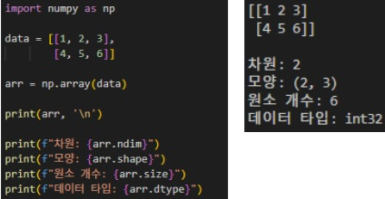
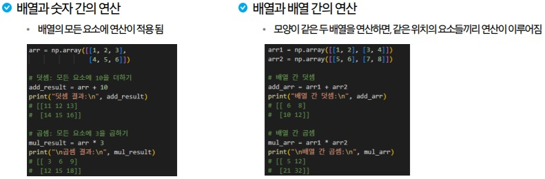
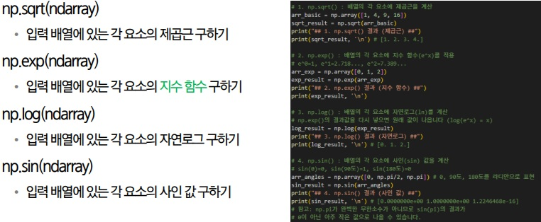
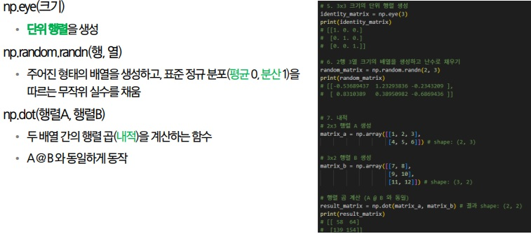
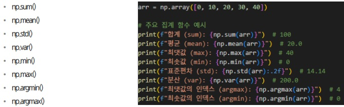
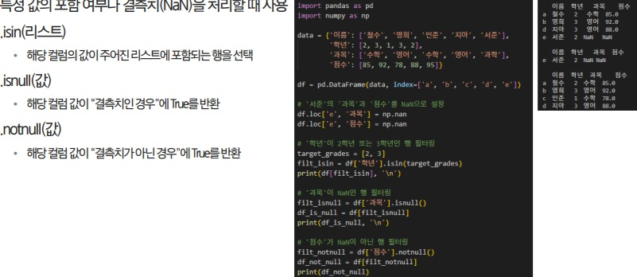

# Numpy
- Numerical Python: 파이썬에서 계산을 빠르게 하기 위한 하이브러리(C 기반으로 실행해서 빠름)
- ndarray(N-dimensional array):
    - 대규모 숫자 데이터를 빠르고 효율적으로 처리하기 위해 만들어진 특수한 데이터 구조
    - 모든 원소를 동일한 데이터 타입으로 저장
    - 다차원 배열을 지원
    - 머신러닝에서 Pandas, TensorFlow, PyTorch와 같은 다른 라이브러리들의 기반이 되는 핵심 데이터 구조
    - 
    - .dtype에서 int32, int64가 나오는 이유:
        - 파이썬 int는 C 언어의 long 기반이여서 필요한 만큼 메모리를 늘릴 수 있는 임의 정밀도(arbitrary precision)정수
        - NumPy는 C로 구현되어 있고, 내부적으로 배열을 메모리에 연속적으로 저장해야 해서 각 요소의 크기가 일정해야 합니다.그래서 NumPy는 int8, int16, int32, int64처럼 정확히 몇 비트인지 명시된 자료형을 사용(운영체제에 따라 다름)
- Function:
    - np.zeros(): 모든 원소가 0으로 채워진 배열 생성/ 주로 배열 틀을 만들고 나중에 값을 채우려고 사용
    - np.ones(): 모든 원소가 1로 채워진 배열 생성/ 초기화, 효율적 수학 연산을 위한 용도로 사용
    - np.full((shape), fill_value): 모든 원소가 특정 값으로 채워진 배열 생성
    - np.arrange(start, end, step): 파이썬의 range와 같지만 결과를 ndarray로 반환
    - np.linspace(start, end, num): start부터 end까지를 num개의 간격으로 나눈 배열 생성(주로 데이터 시각화, 함수 계산, 머신러닝 알고리즘에서 사용)
- 인덱싱
    - 2차원 배열: [행, 열] 형태로 특정 위치의 요소를 선택
    - Boolean Indexing: 조건을 만족하는 요소를 True로 반환하는 인덱싱
    - Fancy Indexing: 특정 위치의 요소를 선택하는 인덱싱 
- 슬라이싱
    - 2차원 배열: [행 시작:행 끝, 열 시작:열 끝] 형태로 특정 범위의 요소를 선택
    - numpy 슬라이싱은 새로운 객체를 생성하지 않고 view를 반환해서 슬라이싱한 객체를 수정하면 원본도 수정됨
- Reshape(행, 열)
    - 원소의 총 개수는 유지하고, 배열의 행과 열 구조를 변경(총 원소 개수가 같아야만 변경 가능)
    - 행이나 열에 한 쪽에 -1을 활용하면 차원 크기를 자동으로 계산해 줌
- 연산
    - 배열의 요소 별 연산 
    - 유니버셜 함수(Universal Functions, ufunc): ndarray의 모든 요소를 대상으로 연산을 수행하는 함수
    - 
    - 
    - 브로드캐스팅: 모양이 다른 배열들 간에도 연산을 가능하게 해주는 기능, 크기가 작은 배열이 큰 배열의 모양에 맞춰 확장돼 연산을 수행
- 집계 함수(Aggregate Functions): 배열을 입력받아, 데이터 전체를 대표하는 하나의 값으로 계산하는 함수
    - 
    - axis 축: 다차원 배열에서 집계 함수를 사용할 때, 연산을 수행할 축을 지정하는 매개변수

# Pandas
- 파이썬의 데이터 분석 라이브러리
- 2차원 배열 형태
- Series: 1차원 데이터, 하나의 열(Column)
- DataFrame: 2차원 데이터, series가 모여 dataframe이 된다
- 데이터프레임 생성 방법:
    1. 딕셔너리를 사용해 pd.DataFrame(arr)으로 생성
    2. pd.DataFrame(arr, columns=columns)로 생성
- Data Inspecting: 데이터의 구조와 내용을 파악하는 것
    - df.head(n): 데이터프레임 처음 n개의 행을 보여줌(defatult=5)
    - df.tail(n): 데이터프레임 끝 n개의 행을 보여줌(defatult=5)
    - df.info(): 데이터프레임의 기술적인 요약 정보를 보여줌, 결측치를 확인하거나 데이터 타입을 파악할 때 사용
        - 변수 타입/ 전체 행의 개수와 인덱스 범위/ 전체 열의 개수/ 각 열의 이름, 데이터 개수(결측치 제외), 데이터 타입/ 메모리 사용량/ 함수의 반환 값
    - df.describe(): 데이터프레임의 기초 통계 정보를 보여줌
        - count(데이터 개수), mean(평균), std(표준편차), min(최소값), 25%, 50%, 75%, max(최대값)
    - df.shape: 데이터프레임의 행과 열의 개수를 튜플 형태로 반환
    - df.columns: 데이터프레임의 열 이름을 리스트 형태로 반환
    - df.index: 데이터프레임의 인덱스를 리스트 형태로 반환
- 인덱싱 & 필터링: 데이터를 원하는 대로 고르고, 걸러내는 작업/ 분석 및 전처리 작업에 유용
    - 열 선택
        1. 한 개의 열 선택 df['컬럼명']: Series 형태로 반환
        2. 여러 개의 열 선택 df[['컬럼명1', '컬럼명2']]: DataFrame 형태로 반환
    - 행 선택
        1. .loc
            - label 기반 선택
            - 슬라이싱으로 여러 행 선택 가능
            - 슬라이싱 시에 끝점을 포함
        2. .iloc
            - integer 기반 선택
            - 슬라이싱으로 여러 행 선택 가능
            - 슬라이싱 시에 끝점 포함하지 않음
        3. [행, 열] 형태로 인자를 전달해 원하는 셀의 값을 선택(.loc, .iloc 둘 다 가능)
    - Boolean Indexing 필터링: 조건을 만족하는 행만 선택
    - 복합 조건 필터링: 여러 조건을 동시에 적용할 때 논리 연산자를 사용해 필터링, 각 조건을 괄호로 묶어 사용
    - 특수 조건 필터링: 
