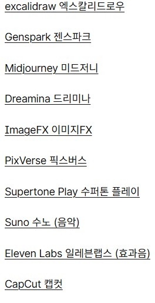

# 25.07.21
1. 12기 선배들 레터링 프로젝트 체험
    - NFC를 활용, apk 설치 후 핸드폰에 태그시 고유식별번호로 우편함 생성, 다른 식별번호 접속시 차단, 아직 오류 있어서 어플이 nfc 권한 요청을 안해서 나만 못함
2. AI 팀 대항 배틀 퀴즈
    -  AI에게 퀴즈 프롬프트 입력, AI가 내주는 문제 풀어보는 체험, 첫 조라서 다른 조 플레이 못 보고 시작해 3등
3. AI 광고영상 제작
    - 현업 종사자 대단하신 분 강의, 강사님 제작하셨던 AI 광고들 체험, 각 조 AI광고 아이디어 구상 후 엘리베이트 미팅으로 소개, 조 1등 작품 소개 및 조원 선정, 아이디어 구체화 후 ai를 통해 제작 예정
# 25.07.22
1. AI 광고영상 제작
    - 아이디어 구체화, 기획, 프롬포트, 영상 제작, 오디오 제작, 영상 편집, 발표 ppt 제작 진행  
    내일 제작 마무리 후 완료 예정
2. AI Tool 종류
- GPTS: 개인비서 느낌
- etc. : 
# 25.07.23
1. AI 광고영상 제작
    - 영상 제작 작업 마무리, ppt 제작 마무리, 발표
2. AI 피규어 만들기
    - 프롬프트로 세계관, 주인공, 컨셉 등 AI 사용해서 제작  
    만들어진 결과물로 이미지 생성  
    이미지 3D 파일로 변환 후 3D 프린팅
3. 사용한 Tool
    - Meshy(3D 파일 변환, STL), Womp(모델링), Bambu Studio(3D프린팅)
# 25.07.24
- AI 피규어 만들기
    - 3D 프린팅 출력, 파손된 출력물 재생성 / 재출력  
    출력물 레진 코팅?, 샌딩, 도색