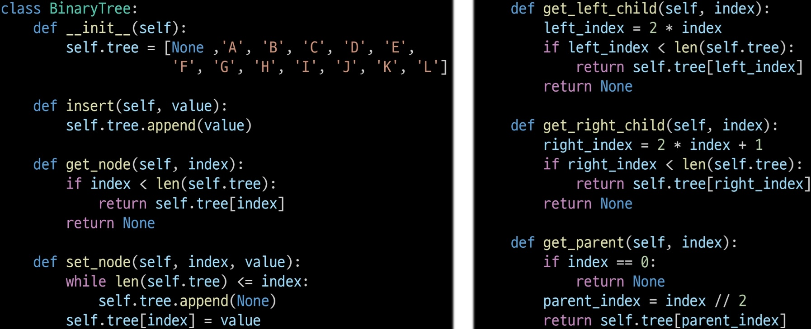
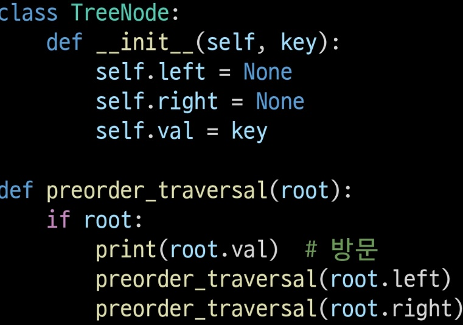
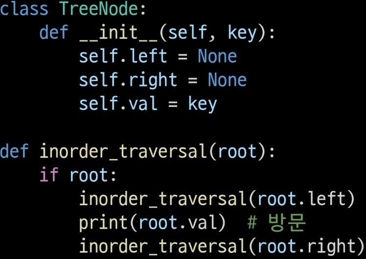
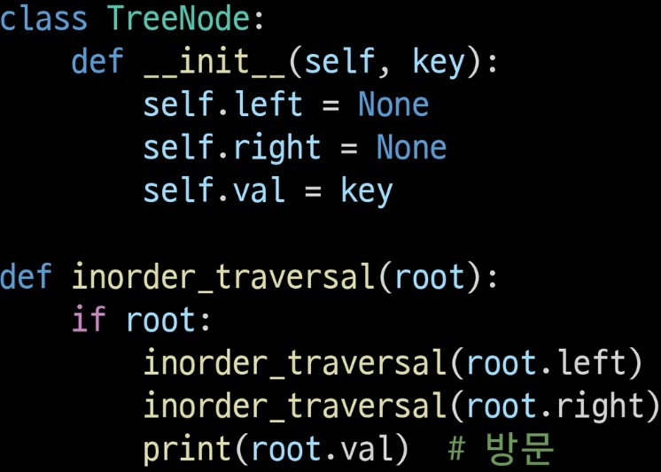

# 트리
- 트리의 개념
    - 구조:
    1. 비선형 구조
    2. 원소들 간에 1:n 관계의 자료구조
    3. 원소들 간에 계층관계를 가지는 계층형 자료구조
    4. 상위 원소에서 하위 원소로 내려가면서 확장되는 트리 모양의 구조
    - 한개 이상의 노드가 있는 유한 집합
    - 최상위 노드 = 루트(root) 나머지 노드 n(>=0)개의 분리 집합
    - 분리 집합은 sub tree(부 트리)
- 트리의 용어
    1. node(노드): 트리의 원소
    2. edge(간선): 노드와 노드를 연결하는 선
    3. root node(시작 노드, 최상위 노드)
    4. andector node(조상 노드): edge따라 root node까지 가는 모든 노드
    5. parent node(부모 노드): child node를 가진 노드
    6. child node(자식 노드): 바로 아래 노드들
    7. sibling node(형제 노드): 같은 부모 노드의 자식 노드들
    8. subtree: parent node와 연결된 edge를 끊었을 때 생성되는 트리
    9. descendant node(자손 노드): 아래 모든 노드들
    10. degree(차수):
        - 노드의 차수: 노드에 연결된 자식 노드 수
        - 트리의 차수: 트리에 있는 노드 차수 중 가장 큰 값
        - 단말 노드: 차수가 0인, 자식 노드가 없는 노드
    11. 레벨: 루트에서 노드까지의 거리
    12. 높이: 루트 노드에서 가장 먼 리프 노드까지의 edge 수
---
## 이진 트리(Binary Tree)
- 모든 노드가 최대 2개의 서브 트리를 갖는 트리(차수가 2인 트리)
- 레벨 i일 때 최대 노드 개수는 2^i개
- 높이가 h면 최소 h+1개 최대 2^h+1 -1 개

### 포화 이진 트리
모든 레벨에 노드가 가득 차 있는 이진 트리
### 완전 이진 트리
순서대로 노드가 2개씩 가득 차 있는 이진 트리
### 편향 이진 트리
높이가 h일 때 최소 개수의 노드를 가지면서 한쪽 방향으로만 자식 노드를 가진 이진 트리
### 이진 트리의 표현
- 루트를 1로 두고 왼쪽부터 차례대로 번호를 부여(중간에 빈 노드가 있어도 있다고 가정하고 번호 매김)
- 노드 번호가 i일 때
    - 부모 노드의 번호 = i/2
    - 왼쪽 오른쪽 자식 노드 번호 = 2*i / 2*i +1
    - 레벨 n의 노드 번호 시작 번호는 2^n
    - 노드 번호를 리스트의 인덱스로 사용
    - 높이가 h인 이진 트리 배열의 크기
        1. 레벨 1의 최대 노드 수 = 2^i
        2. 모든 노드의 수 = 2^h+1 -1
        3. 리스트의 크기 = 2^h+1
- 리스트를 이용한 이진 트리의 표현: 
    - 단점: 편향 이진 트리의 경우 메모리 낭비 발생, 트리의 중간에 새로운 노드를 삽입 or 노드를 삭제할 경우 크기 변경이 어려워 비효율적
- 연결 리스트를 이용한 이진 트리의 표현: 이진 트리의 모든 노드는 최대 2개의 자식 노드를 가지므로 일정한 구조의 이중 연결 리스트 노드를 사용하여 구현
### 이진 트리 순회
순회(treaversal): 각 노드를 중복되지 않게 모두 방문(visit), 트리는 비선형 구조여서 선후 연결 관계를 알 수 없기에 재방문 가능, 특별한 방법 필요, 트리의 노드들을 체계적으로 방문
- 항상 root가 기준
1. 전위순회(preorder traversal): VLR(visit > left > right)  
2. 중위순회(inorder traversal): LVR(left > visit > right)  
3. 후위순회(postorder traversal): LRV(left > right > visit)  
### 수식 트리(Expression Tree)
- 수식을 표현하는 이진 트리
- 수식 이진 트리(Expression binary Tree)
- 연산자는 루트 노드 or 가지 노드
- 피연산자는 모두 leaf node
## 트리 탐색
각 노드를 중복되지 않게 모두 방문(visit), 트리는 비선형 구조여서 선후 연결 관계를 알 수 없기에 재방문 가능, 특별한 방법 필요, 
1. DFS(Depth First Search):
    - 깊이 우선 탐색
    - 루트에서 한 방향으로 가장 깊이 가다가 돌아가서 가장 마지막 갈림길로 돌아가 다른 방향으로 탐색 반복
    - 재귀 / 후입선출 구조의 스택을 사용해 구현
2. BFS(Breadth First Search): 넓이 우선 탐색