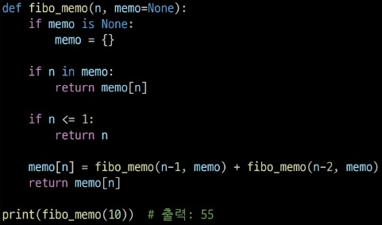
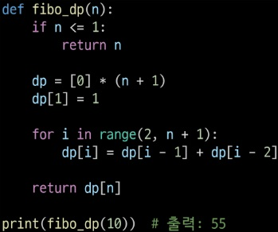

# DP(Dynamic Programming)
- 동적 계획법
- 피보나치 수열: 중복 호출이 너무 많아서 느림

## 메모이제이션(memoization)
- 컴퓨터 프로그램을 실행할 때 이전 계산한 값을 메모리에 저장해 계산 횟수를 줄여 전체적인 실행 속도를 빠르게 하는 기술
- 팁 다운 접근방식(하향식 접근)
- 재귀 함수 호출로 시스템 호출 스택을 사용해서 실행 속도 저하/스택 오버플로우가 발생할 수 있음
- 장점: 코드 구현이 쉽다, 필요한 부분만 계산
- 

## DP(상향식 접근)
- 그리디 알고리즘과 같이 최적화 문제를 해결하는 알고리즘
- 먼저 입력 크기가 작은 부분 문제들을 모두 해결한 후 그 해들을 이용해 보다 큰 크기의 부분 문제들을 해결하여,  
최종적으로 원래 주어진 입력의 문제를 해결하는 알고리즘
- 장점: 재귀 X, 메모리 효율이 좋다
- 단점: 점화식 만들기 어렵다
- 적용 요건
    - 중복 부분문제 구조(Overlapping subproblems)
        - DP만의 특징
        - DP는 큰 문제를 이루는 작은 문제들을 먼저 해결하고 작은 문제들의 최적해(Optimal solution)을 이용해 순환적으로 큰 문제를 해결한다.
        - 순환적인 관계(recurrence relation)을 명시적으로 표현하기 위해 DP에서는 일반적으로 수학적 도구 ★점화식★을 사용한다
        - DP는 문제의 순환적 성질 떄문에 전에 계산됐던 작은 문제의 해가 다른 곳에서 필요하게 되는데(Overlapping subproblems) 이를 위해 이전에 계산한 해들을 어떤 저장 공간(table)에 저장한다
        - 이렇게 저장된 해들이 필요할 때마다 table의 참조를 통해 중복 계산을 피한다.
    - 최적 부분문제 구조(Optimal substructure)
        - 그리디의 특징
        - 문제가 최적화의 원칙(Principle of Optimality)를 만족해야만 동적 계획법을 효율적으로 적용할 수 있다
        - 최적화의 원칙: 어떤 문제에 대한 해가 최적일 때 그 해를 구성하는 작은 문제들의 해 역시 최적
- 
## 분할 정복과 DP의 비교
- 분할 정복
    - 연관 없는 부분 문젤 분할한다.
    - 부분 문제를 재귀적으로 해결한다.
    - 부분 문제의 해를 결합(combine)한다.
    - 하향식 방법
    - ex) 병합 정렬, 퀵 정렬
- DP
    - 부분 문제들이 연관이 없으면 적용할 수 없다. 부분 문제들은 더 작은 부분 문제들을 공유한다.
    - 모든 부분 문제를 한 번만 계산하고 결과를 저장하고 재사용한다.
    - 상향식 방법