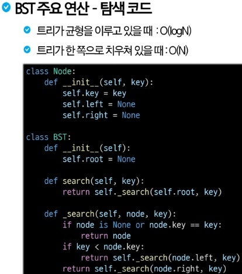
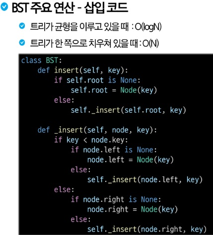
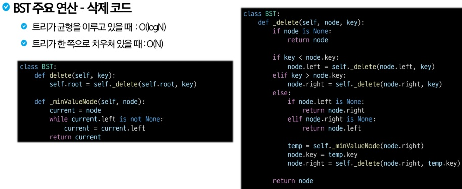

# BST(이진 탐색 트리)
Binary Search Tree
- 데이터의 저장, 검색, 삽입, 삭제를 효율적으로 처리하기 위한 자료구조
- 특징
    - 각 노드가 최대 2개의 자식을 가짐
    - 데이터를 정렬된 형태로 저장하여 탐색/삽입/삭제를 효율적으로 수행
- 구조
    - 이진 트리의 특성을 가지지만 추가로 다음과 같은 속성을 가짐(순서속성)
        - 왼쪽 자식 노드의 키 값이 부모 노드의 키 값보다 작다
        - 오른쪽 자식 노드의 키 값이 부모 노드의 키 값보다 크다
- 장점
    - 배열이나 링크드 리스트와 달리, 삽입/삭제 후에도 데이터가 정렬된 상태를 유지
    - 데이터가 균형 있게 분포되어 있을 때 평균적으로 탐색/삽입/삭제 연산의 시간복잡도가 O(logN)
    - 동적으로 크기를 조정할 수 있어, 크기가 고정된 배열에 비해 유연성이 높음

- 단점
    - 트리가 한 쪽으로 치우치면(균형이 맞지 않으면) 최악의 경우, 시간 복잡도가 O(n)이 될 수 있음
    - 각 노드는 두 개의 자식 포인터를 저장해야 하므로, 큰 데이터 집합의 경우 메모리 오버헤드가 발생할 수 있음
- 높이
    - 특정 노드에서 가장 깊을 리프 노드까지의 경로에 있는 간선의 개수
    - 트리의 높이는 루트 노드의 높이와 동일
    - 리프 노드의 높이는 0
    - 균형 잡힌 트리의 높이는 O(logN), 불균형한 트리의 높이는 O(N)
- 깊이
    - 루트 노드에서 해당 노드까지의 경로에 있는 간선의 수
    - 루트 노드의 높이는 0
- 검색
    - 
- 삽입
    - 
- 삭제
    - 삭제할 노드를 탐색 후 노드를 확인하고 삭제
    1. 리프 노드인 경우 바로 제거
    2. 한 개의 자식을 가질 경우 삭제할 노드의 자식 노드를 삭제할 노드의 부모 노드에 연결
    3. 두 개의 자식을 가진 경우, 중위 후속자 or 중위 전임자 찾기
        - 중위 후속자: 삭제할 노드의 오른쪽 서브 트리에서 가장 작은 값(일반적으로 사용)
        - 중위 전임자: 삭제할 노드의 왼쪽 서브 트리에서 가장 큰 값
    - 
- 정리
    - BST는 탐색 작업을 효율적으로 하기 위한 자료구조이다. 삽입/삭제/검색: 평균 O(logN)
    - 모든 원소는 서로 다른 유일한 키를 갖는다.(보통의 BST)
    - key(왼쪽 서브 트리) < key(루트 노드) < key(오른쪽 서브 트리)
    - 왼쪽 서브 트리와 오른쪽 서브 트리도 이진 탐색 트리다.
    - 중위 순회하면 오름차순으로 정렬 된 값을 얻을 수 있다
- 문제점
    - BST의 구조는 삽입되는 데이터의 순서에 따라 결정되기 때문에 특정 패턴으로 삽입되는 경우 불균형이 발생
        - 뷸균형한 BST의 문제점
        - 검색/삽입/삭제 연산의 시간복잡도가 O(N)이 됨 (균형 잡힌 BST의 경우 O(logN))
        - 트리의 높이가 증가하게 되면서 많은 메모리 공간이 필요
        - 트리의 높이가 증가하게 되면서 깊이 있는 재귀호출로 인해서 스택 오버플로우 문제가 발생할 수 있음
    - 불균형 문제를 해결할 수 있는 방법
        - 자가 균형 트리(Self-Balancing Tree): 1.AVL 트리 2. 레드-블랙 트리
