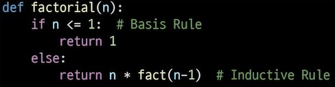
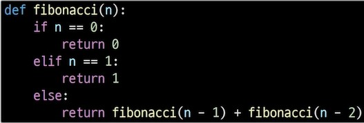
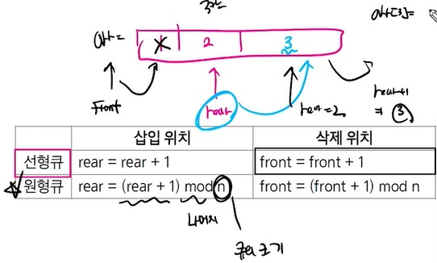

# 스택
- 물건을 쌓듯이 자료를 쌓아올린 형태의 자료구조
- 스택은 선형 구조
    - 선형 구조: 자료간의 관계가 1대1의 관계, 순서가 있다
    - 비선형 구조: 자료간의 관계 1대N의 관계 (ex: 트리, 그래프)
- 스택에서 자료를 삽입하거나 스택에서 자료를 꺼낼 수 있다
- 뒤로 가기나 함수 호출에서 사용되는 자료구조
- 후입 선출 구조(LIFO,Last-In First_Out)
    - 마지막에 삽입한 자료를 가장 먼저 꺼낸다
- top point 응용해서 계산: top point가 있으면 O(1)이 된다
## 스택의 연산
- push: 저장소에 자료를 저장,append
- pop: 저장소에서 자료를 꺼낸다, 꺼낸 자료는 자료의 역순으로 꺼낸다(후입선출)
- IsEmpty: 스택이 공백인지 확인
- Peek: top(가장 마지막에 들어간 자료)에 있는 자료를 반환
## 스택 응용
- 괄호 검사
    - 여는 괄호,닫는 괄호 개수 같기
    - 여는 괄호가 먼저 나오기
    - 괄호 짝이 맞기
      수까지 세라하기 문제 내기 좋다?
# 스택 2
## 계산기(중위/후위  표기법)
- 스택을 이용해서 중위 표기법을 후위 표기법으로 변경
    1. 연산자의 우선 순위에 따라 괄호로 표현
    2. 각 연산자를 대응하는 오른쪽 괄호의 뒤로 이동
    3. 괄호 제거

- 중위 표기법 > 후위 표기법 변환 알고리즘
    1. 중위 표기식에서 토큰을 하나씩 읽는다.
    2. 토큰이 피연산자이면 토큰을 출력한다.
    3. 토큰이 연산자일 때
        1. 우선순위: 토큰>스택의 top 이면 스택에 push
        2. 우선순위: 토큰<=스택의 top 이면 스택에 있는 다음 연산자가 우선순위가 작을 때까지 pop 하고 push
        3. top에 연산자가 없다(스택에 연산자가 없으면) 바로 스택에 push
    4. 토큰이 닫는 괄호('),},]')면 스택 top 에 여는 괄호가 올 때까지 pop 하고 출력 여는 괄호 만나면 pop 출력X
    5. 표기식에 남은 토큰이 있으면 다시 반복, 없으면 그만
    6. 스택에 남아있는 연산자를 모두 pop 해서 출력
       ex)(6+5*(2-8)/2)
       ((6+5)*(28-)/2)
       ((6+5)(28-*)/2)
       ((6+5)(28-*2/))
       (6528-*2/+)
       6528-*2/+

234*5/+
2+3*4+5
2+34*+5
234*+
234*+5+
연산자 나오면 스택에 저장, 스택에 있는 연산자 우선순위 or 같으면 꺼내고 우선순위가 낮은 애를 집어넣기

3+(2*5)-8/4
3+25*-84/
(325*+)-84/
325*+84/-

# 재귀 호출
## 재귀함수
  - 기본부분:종료조건, 유도부분:작아지는 부분 두 부분으로 이루어진다
  - 함수 호출은 스택을 사용하여 메모리, 속도에서 성능저하가 발생한다
    - 알아둘 함수의 특징
      1. Pass by Value: immutable(int, str, tuple)등을 인자로 전달하면 값만 복사되고 변하지 않음
      2. Pass by reference: mutable(list, dict, set)등을 인자로 전달하면 원본 객체까지 변한다
  - 함수가 끝나면 main으로 돌아가는게 아니고 호출했던 함수로 돌아간다.
## 팩토리얼
  - n!: 1부터 n까지 모든 자연수를 곱하는 연산
## 피보나치 수열
- 이전의 두 수의 합을 다음 항으로 하는 수열

# 큐(queue)
## 구조와 작동원리
- 스택과 마찬가지로 삽입과 삭제의 위치가 제한적인 자료구조, 선형 자료구조
    - 큐는 뒤에서만 삽입만, 앞에서는 삭제만
- 선입선출(FIFO,First In First Out)
## 주요 연산
- EnQueue(append)
  - 큐의 뒤쪽에 원소 삽입
- DeQueue
  - 큐의 앞쪽에서 원소 삭제하고 반환
- IsEmpty
  - 공백인지 확인
- IsFull
  - 포화상태인지 확인
- peek
  - 앞쪽에서 원소를 삭제하지 않고 반환
- createQueue
  - 공백 큐 생성
## 응용
- 버퍼
  - 데이터를 한 곳에서 다른 곳으로 이동하는 동안 일시적으로 그 데이터를 보관하는 메모리의 영역
  - 일반적으로 입출력 및 네트워크와 관련된 기능에서 이용
  - 순서대로 입력/출력/전달 되야하기 때문에 FIFO 큐 활용
- 마이쮸
## 원형큐
- 선형 큐를 이용해 삽입, 삭제를 반복하면 리스트의 앞부분이 비었어도 활용할 수 없다
- 해결방법: 논리적으로 배열의 처음과 끝이 연결됐다고 가정하고 사용(맨 앞에 빈 칸을 만든다)
- 공백 상태와 포화 상태를 구분하기 위해 front가 있는 자리는 항상 빈 자리로 둠
- front와 rear가 마지막 인덱스인 n-1을 가리키면 나머지 mod를 이용해서 처음 인덱스 0으로 이동
## pop 대신
from collections import deque 진짜 많이 쓰임 queue.popleft rotate

## 연결 리스트
# 리스트의 문제점
- 자료의 삽입/삭제 연산 과정에서 원소들을 이동시키는 작업이 필요하다
- 원소의 개수가 많고 삽입/삭제 연산이 빈번하게 일어날수록 소요되는 시간이 크다
## 연결 리스트

#from collections import dequeue     