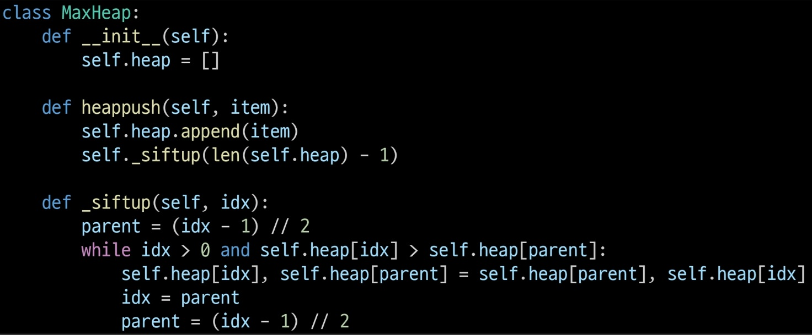
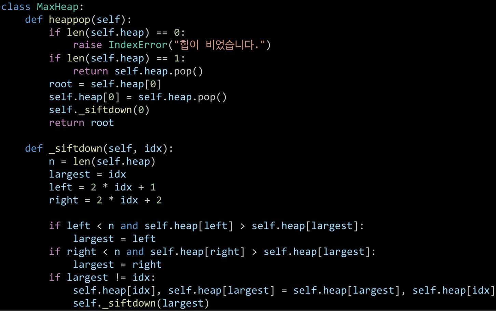
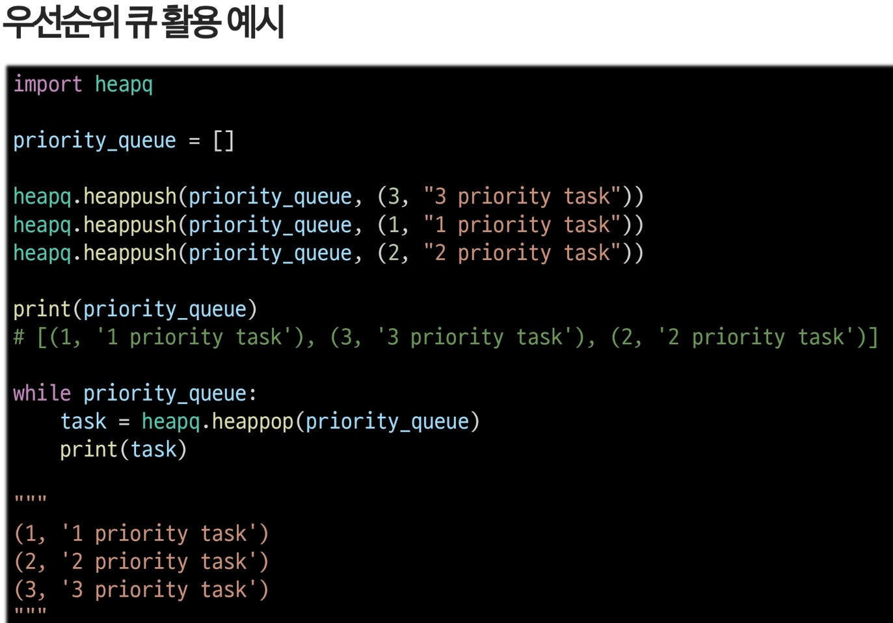

# 힙(heap)
- 완전 이진 트리에 있는 노드 중에서 키 값이 가장 큰 노드나 키 값이 가장 작은 노드를 찾기 위해서 만든 자료구조
- 최대 힙(max heap)
    - 키 값이 가장 큰 노드를 찾기 위한 완전 이진 트리
    - 부모 노드의 키 값 > 자식 노드의 키 값
    - 루트 노드: 키 값이 가장 큰 노드
- 최소 힙(min heap)
- 삽입
    1. 새로운 원소를 heap의 마지막 위치(리스트의 끝)에 추가한다.
    2. 새로 추가된 원소를 부모 노드와 비교하며, 힙 속성을 만족할 때까지 위로 올린다.
    - 시간 복잡도: 최선 = O(1) 평균/최악 = O(logN)
    - 
- 삭제
    - heap은 루트 노드의 원소만 삭제 가능
    1. 루트 노드를 제거하고 힙의 마지막 요소를 루트 위치로 이동(완전 이진 트리 유지하기 위해 이동)
    2. 새 루트를 자식 노드들과 비교하며, 힙 속성을 만족할 때까지 아래로 내린다
    - 시간 복잡도: 최선 = O(1) 최악 = O(logN)
    - 
## heapq 모듈
- 최소 힙을 구현한 라이브러리
- heap 함수 활용
    - heapq.heapify(x): 리스트 x를 heap으로 변환 (O(N))
    - heapq.heappush(heap, item): item을 heap에 추가
    - heapq.heappop(heap): heap에서 가장 작은 원소를 pop하고 리턴
- heap은 최소힙이기 때문에 모든 값을 음수로 변환하면 최대힙처럼 사용 가능

### 우선순위 큐
- 우선순위를 가진 항목들을 저장하는 큐
- FIFO 순서가 아니라 우선순위가 높은 순서대로 나가게 된다.
- 우선순위 큐를 구현하는 방법 중 힙(Heap) 기반의 구현(우선순위를 원소로 활용, 최대 힙을 사용하면 높은 우선순위 요소가 먼저 나오도록 구현)이 가장 효율적
- 시간 복잡도: 노드 하나의 추가/삭제 = O(logN), 최대값/최소값 = O(1)
- 