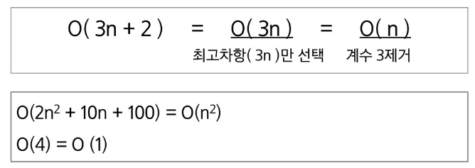
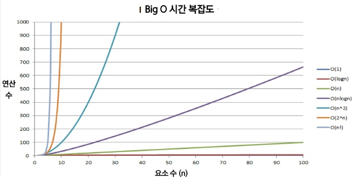
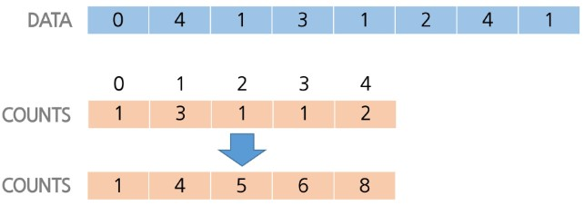
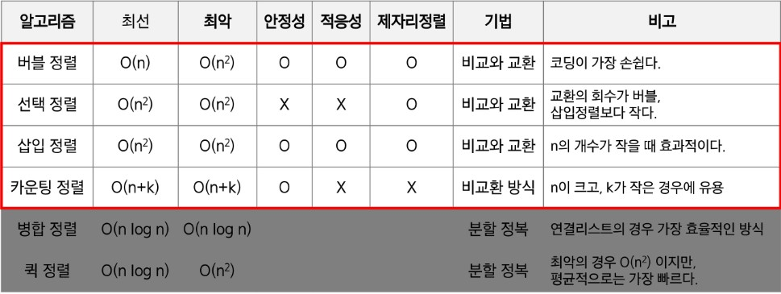
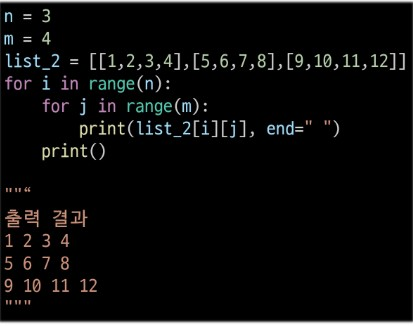
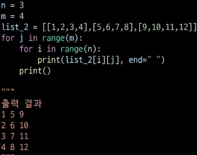
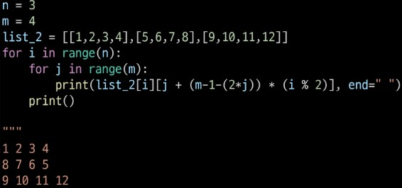
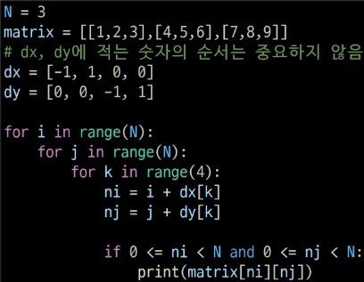

# 알고리즘
- 유한한 단계로 문제를 해결하기 위한 절차, 방법
## 알고리즘 표현 방법
- 의사코드(슈도코드, Pseudocode)
- 순서도
- 프로그래밍 언어
## 좋은 알고리즘이란?
- 정확성: 정확한 동작
- 작업량: 적은 연산으로 결과 도출
- 메모리 사용량: 적은 메모리 사용
- 단순성: 단순한 알고리즘
- 최적성: 개선할 여지 없이 최적화
# 복잡도
## 시간 복잡도
- 실제 걸리는 시간 측정
- 실행되는 명령문 개수 계산
## 시간 복잡도 ≒ 빅-오(O)표기법
- 알고리즘이 가장 느리게 실행될 때의 (최악)성능
- 시간 복잡도 함수 중 가장 큰 영향력을 주는 n에 대할 '항'만을 표시
- 계수(Coefficient)는 생략
- 
- 
- O(1) > O(logn) > O(n) > O(nlogn) > O(n^2) > O(2^n) > O(n!)
- 실행시간 시간복잡도 logN,N,NlogN 안쪽으로 가능하게 짜기(난이도가 높고 확신이 없을 때 시간복잡도부터)
- 시간복잡도 : 연산의 작업량, 수행시간
    - 최선의 경우 (Bset Case): 빅 오메가 표현법(Ω(n))
    - 평균적인 경우 (Average Case): 빅 세타 표기법(θ(n))
    - 최악의 경우 (Worst Case): 빅 오 표기법(O(n))
- 공간 복잡도: 메모리 사용량
# 리스트
- 다양한 요소들을 **순서대로** 저장할 수 있는 자료구조
- 필요성
  - 여러개의 변수가 필요할 때, 일일이 변수명을 매치하지 않아도 됨
  - 하나의 선언으로 여러가지 변수 선언할 수 있고, 배열을 활용해 여러가지 작업을 할 수 있다
## 1차원 리스트
# 정렬 방식
- 버블 정렬: for문으로 처음부터 끝까지 비교해 최고값을 맨 뒤에 저장
  - 최악 시간복잡도: O(n^2)
  - 최선 시간복잡도: Ω(n)
  - 안정성: O
  - 적응성: O
  - 제자리 정렬: O
- 선택 정렬: 주어진 자료들 중에 가장 작은 애를 찾고 선택해서 맨 앞과 위치 교환
  - 최악 시간복잡도: O(n^2)
  - 최선 시간복잡도: O(n^2)
  - 안정성: X 
  - 적응성: X
  - 제자리 정렬: O 
- 삽입 정렬: 정렬/미정렬로 나누고, "미정렬" 부분의 원소를 "정렬된" 부분의 올바른 위치에 삽입  
  / 맨 앞을 정렬된으로 놓고 뒤에 애들을 미정렬 부분으로 둬서 뒤 애들 비교
  - 대부분 정렬된 경우, 작은 데이터 셋에 효율적
  - 최악 시간복잡도: O(n^2)
  - 최선 시간복잡도: Ω(n)
  - 안정성: O
  - 적응성: O
  - 제자리 정렬: O 
- 카운팅 정렬: 순서를 결정하기 위에 집합에 항목이 몇 개씩 있는지 세는 작업, 선형 시간에 정렬하는 효율적인 알고리즘
- 정수 or 정수로 표현할 수 있는 자료에만 적용 가능, 집합 내의 가장 큰 값을 알아야 한다.  
  최댓값이 k니깐 n은 k+1, 정렬하고 각 항목의 앞에 위치할 항목의 개수를 반영하려고 counts의 원소를 조정:누적합
- 순서: 1. 최대값 찾기 2. 할당하기 3. 개수 세기 4.들어갈 범위(누적합 리스트 만들기) 5.리스트 역으로 접근
- N이 크고, k가 작은 경우에 유용 
  - 최악 시간복잡도: O(n+k)
  - 최선 시간복잡도: O(n+k) n: 리스트 길이, k: 정수의 최댓값
  - 안정성: O
  - 적응성: X
  - 제자리 정렬: X

- 퀵 정렬: 
  - 최악 시간복잡도: 
  - 최선 시간복잡도: 
  - 안정성: 
  - 적응성: 
  - 제자리 정렬: 
- 병합 정렬: 
- 최악 시간복잡도: 
  - 최선 시간복잡도: 
  - 안정성: 
  - 적응성: 
  - 제자리 정렬: 
## 알고리즘 개념, 원리
- 최악 시간복잡도: 
- 최선 시간복잡도:  
- 안정성: 동일한 키 값을 가지는 요소의 상대적 순서를 보존, 정렬 후에 순서를 보존
- 적응성: 초기 정렬 -> 속도가 바뀌나?
- 제자리 정렬: 외부 메모리를 쓰나?, 안에 있는 값들만 쓰냐
## 2차원 리스트
- 리스트의 각 요소가 또 다른 리스트다 (리스트[[1층][2층][3층]])
- 2차원 리스트 순회: 행*열 모든 원소 조사하기
  - 
  - 
  - 
  - 
- 델타 탐색: 한 좌표에서 인접한 요소들 탐색하는 방법

주 대각선 + 역 대각선 합 써보기

이웃 요소와의 차 써보기
절대값 - abs
델타탐색 dx dy
0이상 n미만이어야 출력