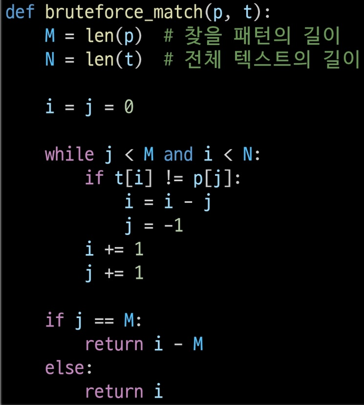

# 문자열 매치
- 문자열 패턴 매칭
    - 패턴 매칭에 사용되는 알고리즘
    1. 브루트포스 탐색 알고리즘
    2. 라빈-카프 알고리즘
    3. 보이어-무어 알고리즘
    4. KMP 알고리즘
    
## 브루트포스(brute-force)
본문 문자열을 처음부터 끝까지 차례대로 순회하면서 패턴 내의 문자들을 일일이 비교하는 방식

- 시간복잡도: 최악의 경우 시간 복잡도는 텍스트의 모든 위치에서 패턴을 비교해야 하므로 O(NM)이 됨

## 라빈-카프 알고리즘
    - 문자열 검색을 위해 해시 값 함수를 사용
    - 패턴 내의 문자들을 일일이 비교하는 대신에 패턴의 해시 값과 본문 안에 있는 하위 문자열의 해시 값만을 비교
    - 최악의 시간 복잡도는 O(NXM)이지만 평균적으로는 선형에 가까운 빠른 속도를 가지는 알고리즘
- 고려사항
    - 처음 해쉬 값을 구할 때는 찾고자 하는 문자열에서 패턴 길이만큼 읽어서 구한다.
    - 패턴이 문자열이며 길이가 커지면 길이를 일정 자리수로 맞추기 위해 mod연산을 취해준다
    - 따라서 해쉬 값이 일치하더라도 실제 패턴이 일치하지 않을 수 있기에 해쉬 값이 일치하면 문자열 일치를 검사한다.(=해쉬 충돌)

## 보이어-무어 알고리즘
- 브루트포스, 라빈-카프는 텍스트 문자열의 문자를 적어도 한 번씩 비교함: 최선 시간 복잡도= Ω(n) / 보이어무어 = O(N/M)
- 보이어-무어 알고리즘의 경우에는 텍스트 문자를 다 비교하지 않음: 입력에 따라 다르지만 일반적으로 θ(n) 보다 시간이 덜 소요됨
- 발상의 전환: 패턴의 오른쪽부터 왼쪽으로 비교

## KMP 알고리즘
- Knuth-Morris-Pratt Algorithm: 불일치가 발생한 텍스트 문자열의 앞 부분에 어떤 문자가 있는지를 미리 알고 있으므로,  
불일치가 발생한 앞 부분에 대해 다시 비교하지 않고 매칭을 수행
- 패턴을 전처리하여 부분일치 테이블 배열 pi[k]를 구해서 잘못된 시작을 최소화함
    - pi[k]: 처음부터 k 인덱스까지를 끝으로 하는 부분 문자열에서 접두사와 접미사가 일치하는 최대 길이
- 시간복잡도: O(M + N)