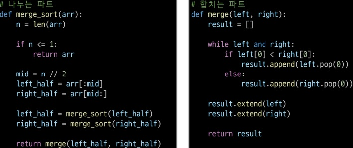
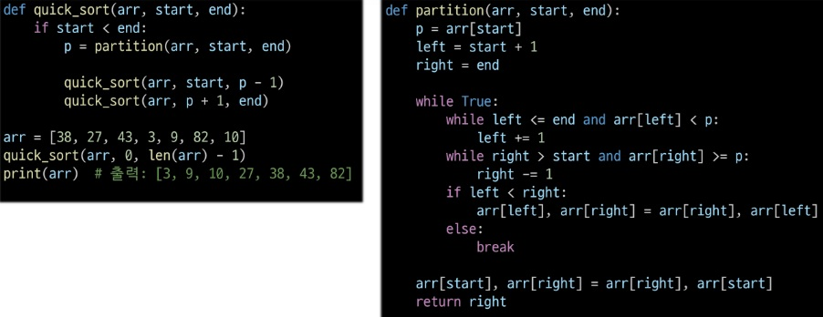

# 분할 정복
Divide and Conquer: 복잡한 문제를 더 작은 하위 문제들로 나누어 해결하는 알고리즘
- 설계 전략
    - 분할(Divide): 해결할 문제를 여러 개의 작은 부분으로 나눈다.
    - 정복(Conquer): 나눈 문제를 각각 해결한다.
    - 통합(Combine): 필요하다면 해결된 해답을 모은다.

## 이진 탐색(Binary Search)
- 자료의 가운데에 있는 항목의 키 값과 비교하여 다음 검색의 위치를 결정하고 검색을 계속 진행하는 방법
    - 목적 키를 찾을 때까지 이진 검색을 순환적으로 반복 수행함으로써 검색 범위를 반으로 줄여가면서 보다 빠르게 검색을 수행
- ★이진 검색을 하기 위해선 자료가 정렬된 상태여야 한다.
- 검색 과정
    1. 중앙에 있는 원소를 고른다
    2. 중앙 원소의 값과 목표 값을 비교한다.
    3. 목표 값이 중앙 원소의 값보다 작으면 자료의 왼쪽 반, 크다면 오른쪽 반에 대해서 새로 검색을 수행한다.
    4. 목표 값을 찾을 때까지 1~3을 반복한다.
- 이진 검색(반복)
    - 
- 이진 검색(재귀)
    - .jpg)
- Parametric Search

## 정렬
- 병합 정렬
    - 여러 개의 정렬된 자료의 집합을 병합하여 한 개의 정렬된 집합으로 만드는 방식
    - 분할 정복 알고리즘 활용
        - 자료를 최소 단위의 문제까지 나눈 후에 차례대로 정렬하여 최종 결과를 얻어냄
    - 정렬 과정
        1. 주어진 배열을 같은 크기의 두 부분의 배열로 나눈다. (재귀적으로 반복해 나눠지지 않을 때까지)
        2. 나눠진 두 배열을 하나의 정렬된 배열로 병합한다.
        3. 위 과정을 재귀적으로 적용해 전체 배열이 정렬될 때까지 반복
    - 시간 복잡도: O(nlogn)
    - 
    - 정리
        - 큰 데이터셋을 정렬할 때 유용, 안정적이고 예측 가능한 성능을 제공
        - 시간복잡도: 최선/최악 = O(nlogn)
        - 안정성: O / 적응성, 제자리 정렬: X
- 퀵 정렬
    - 주어진 리스트를 두 개로 분할하고, 각각을 정렬한다.
    - 퀵 정렬은 분할할 때, 기준 아이템(pivot item)을 중심을 이보다 작은 것은 왼편, 같거나 큰 것은 오른편에 위치한다.
    - 정렬 과정
        1. 리스트에서 하나의 요소를 피벗으로 선택
        2. 피벗보다 작은 요소들은 왼쪽, 큰 요소들은 오른쪽으로 이동
        3. 2번 과정을 통해 최종 위치에 놓인 피벗을 기준으로 왼쪽/오른쪽 부분 배열에 대해 각각 퀵 정렬을 재귀적으로 수행
        4. 부분 배열의 크기가 1 이하가 되면 재귀를 종료
    - 시간 복잡도: O(nlogn)
    - 
    - 정리
        - 평균적으로 매우 빠르고, 메모리 효율이 좋음
        - 시간 복잡도: 최선 = O(nlogn), 최악 = O(n²)
        - 안전성: X / 적응성, 제자리 정렬: O