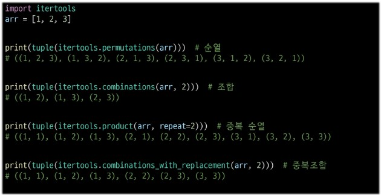

# 대표적인 문제 해결 기법
- 완전탐색
  - 답이 될 수 있는 모든 경우를 시도해보는 알고리즘
  - Brute-force, generate-and-test
  - 대부분 문제에 적용 가능
  - 상대적으로 빠른 시간에 문제 해결 가능
  - 일반적으로 경우의 수가 작으면 유용

- 탐욕 알고리즘

- 분할 정복

- 다이나믹 프로그래밍

## 순열(permutation)
서로 다른 것 중 몇개를 뽑아서 순서대로 나열하는 것(순서 중요)
- 시간복잡도: N!/(N-r)!/r=선택하는 원소의 개수
- 중복순열: 순서를 고려하지만 같은 원소를 여러번 선택하는 방법
```bash
import itertools
print(tuple(itertools.permutations(arr)))  # 순열
print(tuple(itertools.product(arr, repeat=2)))  # 중복 순열(원소가 2개인 순열들)
```
## 조합(Combination) 많이 중요
  - 순서가 상관 없다
  - 시간복잡도 N!/(N-r)!/r!
  - 조합의 개수: 6C3 = 6*5*4/3*2

- 중복 조합
순서를 고려하지 않고 여러 번 선택할 수 있게 나열하는 모든 가능한 방법
```bash
print(tuple(itertools.combinations(arr, 2)))  # 조합
print(tuple(itertools.combinations_with_replacement(arr, 2)))  # 중복조합
```


## 부분집합
- 집합에 포함된 원소들을 선택(많은 중요 알고리즘들이 최적의 부분 집합을 찾는데 사용)
- 부분 집합의 수: 2^n


## 탐욕 알고리즘
- 최적해를 구하는 데 사용되는 근시안적인 방법
- 최적화 문제랑 가능한 해들 중 가장 좋은 해를 찾는 문제
- 일반벅으로, 머리 속에 떠오르는 생각을 검증 없이 바로 구현하면 탐욕적 접근이 된다
- 여러 경우 중 하나를 선택할 때마다 최적이라고 생각되는 것을 선택해 나가는 방식으로 진행해 해답에 도달
- 최종적인 해답을 만들었어도, 그 값이 최적이라는 보장이 없다
- 한번 선택된 것은 번복하지 않는다. 이런 특성 때문에 대부분의 탐욕 알고리즘은 단순하며, 제한적인 문제들에 적용된다.
ex) 잔돈 : 가장 큰 애부터 차례대로 준 값 |  
  가장 큰 애부터 순서대로 잔돈을 나눠봐서 나머지가 0인 친구로 다 준 값 ex) 800 / 400 나머지 0 | 비교해서 적은 값
ex) knapsack: 0-1 knapsack, Fractional Knapsack
- 탐욕 알고리즘의 필수 요소
  - 탐욕적 선택 속성: 탐욕적 선택은 최적해로 갈 수 있음을 보여라(탐욕적 선택은 항상 안전하다)
  - 최적 부분 구조: 최적화 문제를 정형화하라(하나의 선택을 풀면 풀어야할 하나의 하위 문제가 남는다)
  - [원문제의 최적해=탐욕적 선택+하위 문제의 최적해] 임을 증명해라
- 대표적인 탐욕 기법의 알고리즘들
  - prim: N개의 노드에 대한 최소 신장트리(MST)를 찾는다.(서브트리를 확장하면서 MST를 찾는다)
  - Kruskal: N개의 노드에 대한 최소 신장트리(MST)를 찾는다.(싸이클이 없는 서브 그래프를 확장하면서 MST를 찾는다)
  - Dijkstra: 주어진 정점에서 다른 정점들에 대한 최단 경로를 찾는다.(주어진 점에서 가장 가까운 정점을 찾고, 그 다음을 반복해서 찾는다)
## 비트 연산
- 비트와 바이트:
  - 1 bit: 0과 1로 표현하는 정보의 단위
  - 1 byte: 8 bit를 묶어 1byte 라고 한다.
```bash
- 비트 연산자:
  - &: AND
  - |: OR
  - ^: XOR
  - ~: 비트 반전(~n = -(n+1))
  - <<: 비트 열을 왼쪽으로 이동
  - >>: 비트 열을 오른쪽으로 이동
```