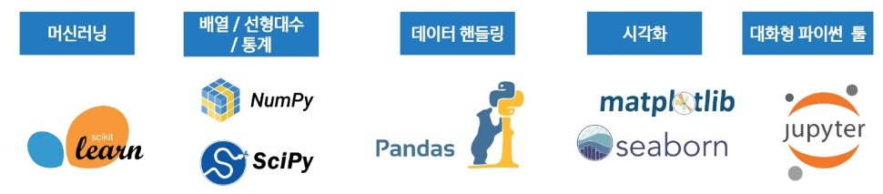
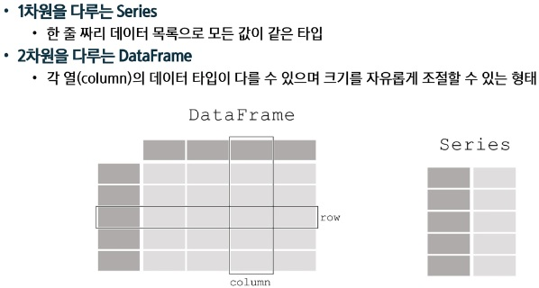
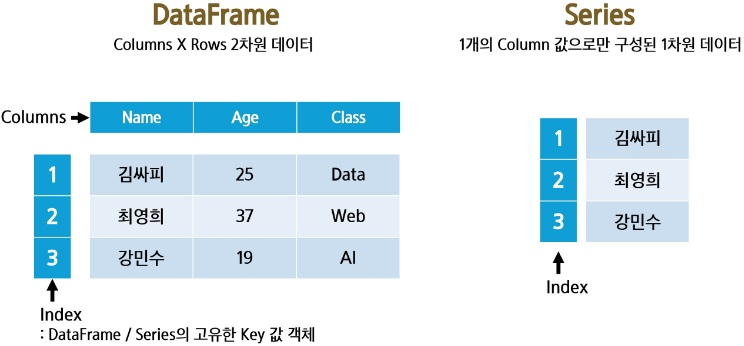

# Pandas 기초
## 데이터 분석 개론
- 데이터 분석의 중요성 및 역할
    - 데이터 분석의 이유: 합리적인 의사 결정을 위해 갖고있는 자원에서 최저의 선택
- 데이터 분석 프로세스
    - 데이터 분석 방법:
        1. 가설 설정 및 데이터 만들기 (인터뷰, 리서치, 데이터 설계 후 수집)
        2. 필요한 데이터 선별 및 조회 (쿼리 조회, 데이터 가공, 인프라 구축)
        3. 데이터 기반 가설 검증 (통계 분석, 수학적 모델링)
        4. 결과 공유 (데이터 시각화, PPT 작성, PT)
    - 데이터 분석 절차
        1. 문제 정의
        2. 데이터 기획
        3. 데이터 수집
        4. 데이터 전처리
        5. 데이터 시각화
        6. 분석 및 인사이트 도출
- 데이터 관련 직무: 데이터 분석가, 데이터 사이언티스트, 데이터 엔지니어, ML/DL 엔지니어, PM
- 파이썬 머신러닝 생태계: 
## Pandas의 개념 및 활용
- Pandas
    - 관계형(realional) 혹은 레이블(labeling)된 데이터를 효율적으로 다루기 위해 설계된 Python 기반의 데잍 분석 라이브러리
    - 빠르고 유연하며 표현력이 풍부한 데이터 구조를 제공
    - 다양한 데이터 분석 작업을 손쉽게 처리할 수 있도록 고수준의 빌딩 블록(high-level building blocks) 제공
    - 오픈 소스 라이브러리이기 때문에 누구나 자유롭게 사용
    - NumPy를 기반으로 개발되었기 때문에, 과학 계산 및 머신러닝 라이브러리들과의 호환성과 통합성을 갖춤
- Pandas에서 다룰 수 있는 데이터의 타입
    - SQL table, Excel spreadsheet 같이 유형이 다른 열들을 포함할 수 있는 표 형식의 데이터 (Tabular data)
    - 순서가 있거나 (Ordered) 없는 (Unordered) 데이터
    - 시계열 (Time series) 데이터
    - 행 및 열이 있는 임의의 행렬 데이터 (행렬의 각 구성요소가 다른 유형의 데이터들도 가능)
    - 다른 유형의 관찰/ 통계 데이터셋 (명시적인 레이블이 없어도 유연하게 처리 가능)
- Pandas Data structure: 
- Pandas의 장점:
    - 결측치 처리 용이: NaN으로 결측값 표현, dropna, fillna 등 제공
    - 행/열 추가*삭제 간편: append, drop 등으로 손쉽게 조작
    - 정렬 기능: 자동 또는 sort_values, sort_index로 명시적 정렬 가능
    - GroupBy 제공: SQL처럼 그룹 단위 집계 가능
    - 다양한 객체 변환: 리스트, 딕셔너리, NumPy 등에서 DataFrame 생성 가능
    - Merge/Join 지원: merge, join, concat 등으로 데이터 결합
    - 파일 입출력 지원: CSV, Excel, DB, JSON 등 다양한 포맷 읽기/쓰기 가능
- Pandas의 주요 구성 요소: 
## 데이터 프레임 생성 및 조작
- Pandas 주요 메서드:
    - read_csv(): CSV 파일을 데이터프레임으로 불러옴
    - head(x): 데이터프레임의 상위 x개 행을 출력
    - shape: 데이터프레임의 행과 열 개수를 출력
    - info(): 데이터프레임의 컬럼, 데이터 타입. 결측치 정보를 출력
    - describe(): 수치형 데이터의 요약 통계를 제공
    - value_counts(): 특정 컬럼의 값 개수를 세어 출력
    - sor_values(): 특정 컬럼 기준으로 정렬
