# HTTP
HTML 문서와 같은 리소스들을 가져올 수 있도록 해주는 규약, 웹에서 이루어지는 모든 데이터 교환의 기초
- 특징:
    1. 비연결 지향(connectionless): 서버는 요청에 대한 응답을 보낸 후 연결을 끊음
    2. 무상태(stateless): 연결을 끊는 순간 통신이 끝나며 상태 정보가 소멸됨
---
# 쿠키
서버가 사용자의 웹 브라우저에 전송하는 작은 데이터 조각 / 서버가 제공 / 사용자 인증, 추적, 상태 유지 등에 사용되는 데이터 저장 방식
- 쿠키의 원리와 활용
    1. 저장 방식: 브라우저는 KEY-VALUE 형식으로 저장 / 이름, 값, 만료 시간, 도메인, 경로 등의 추가 속성이 포함
    2. 전송 과정: Set-Cookie 필드로 클라이언트에게 쿠키 전송 / 브라우저는 쿠키를 저장했다가 동일한 서버에 재요청 시 Cookie 필드에 저장된 쿠키를 함께 전송
    3. 쿠키의 주요 용도: 요청들이 동일한 브라우저에서 들어왔는지 판단할 때 주로 사용 / 사용자의 로그인 상태를 유지할 수 있음 / 상태가 없는(stateless) HTTP 프로토콜에서 상태 정보를 기억시켜 주는 역할
- 쿠키 사용 목적
    1. 세션 관리: 로그인, 아이디 자동 완성, 공지 하루 안보기, 팝업 체크, 장바구니 등의 정보 관리
    2. 개인화: 사용자 선호 설정(언어, 테마 등) 저장
    3. 트래킹: 사용자 행동 기록 및 분석
- 쿠키 종류별 수명
    1. Session cookie: 현재 세션이 종료되면, 브라우저가 종료되면 세션이 삭제됨
    2. Persistant cookies: Expires 속성에 지정된 날짜, Max-Age 속성에 지정된 기간이 지나면 삭제됨
- 쿠키의 보안 장치
    1. 제한된 정보: 보통 중요하지 않은 정보만 저장(사용자 ID, 세션 번호 등)
    2. 암호화: 중요한 정보는 서버에서 암호화해서 쿠키에 저장
    3. 만료 시간: 쿠키에는 만료 시간을 설정, 기간이 지나면 자동으로 삭제
    4. 도메인 제한: 쿠키는 특정 웹사이트에서만 사용할 수 있도록 설정할 수 있음
---

# 세션
서버 측에서 생성되어 CS간의 상태 유지, 상태 정보를 저장하는 데이터 저장 방식
- 작동 원리
    1. 클라이언트가 로그인 성공하면 서버가 session 데이터를 생성 후 저장
    2. 생성된 session 데이터에 인증할 수 있는 session id를 발급
    3. 발급한 session id를 클라이언트에게 응답(데이터는 서버에 저장하고 id만)
    4. 클라이언트는 session id를 쿠키에 저장
    5. 클라이언트가 다시 서버에 접속하면 쿠키 안에 session id가 저장됐기에 로그인 중이라는 것을 확인
- 쿠키는 사용자 브라우저에 저장, 세션은 암호화해서 서버에 저장
- Django Session
    - Django는 'database-backed sessions' 저장 방식이 기본 값
    - session 정보는 DB의 django_session 테이블에 저장
    - Django는 요청안에 특정 session id를 포함하는 쿠키를 사용해서 각각의 브라우저와 사이트가 연결된 session 데이터를 알아냄
    - Django는 우리가 session 매커니즘에 대부분을 생각하지 않게 미리 만들어둠
---

# Django Authenticaiton System
사용자 인증과 관련된 기능을 모아놓은 시스템
## Custom User Model
- 기본 User Model의 한계: auth앱에 기본 정의된 필드가 제한적이여서 추가적인 정보가 필요하면 Model 변경하기 어려움
- Custom User Model로 대체하기:
    1. AbstractUser 클래스를 상속받는 커스텀 User 클래스 작성: 기존 클래스를 상속받기에 기존 클래스와 같은 모습  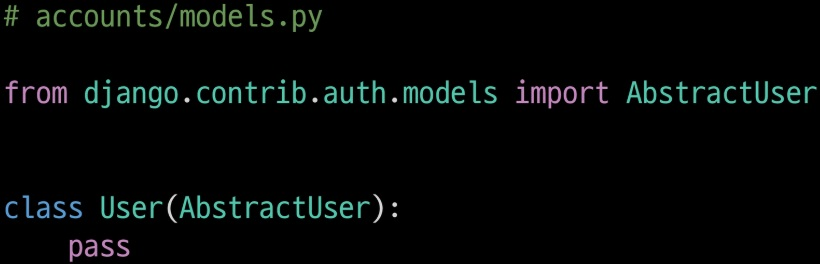
    2. settings.py에서 AUTH_USER_MOEDL = 'accounts.User'로 변경(기본 값은 'auth.User')
    3. admin.py에 User 모델 import  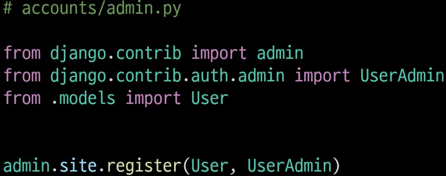
- 프로젝트 중간에 AUTH_USER_MODEL을 변경할 수 없기에 시작부터 변경하고 진행(어차피 기본 USER 모델과 동일하고 중간에 model 변경 가능)
## Login
Session을 Create하는 과정
- AuthenticationForm(): 로그인 인증에 사용할 데이터를 입력 받는 built-in form  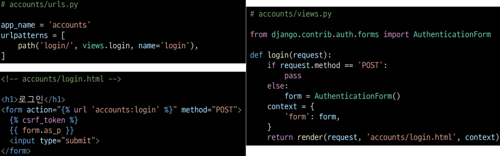
- login(request, user): AuthenticationForm으로 인증된 사용자를 로그인 하는 함수
- get_user(): 인스턴스 메서드, is_valid인 로그인 사용자 객체를 반환
- django_session 테이블 or 브라우저 - 개발자도구 - Application - Cookies 에서 확인 가능
    - Template with Authentication date: 템플릿에서 인증 관련 데이터를 출력하는 방법
        - {{ user.username }}: django가 context 데이터를 미리 만들어둠
        - context processors: 템플릿이 렌더링 될 때 호출 가능한 context data 목록, django가 자주 사용하는 데이터 목록을 load해 둔 것으로 기본적으로 템플릿에서 사용 가능한 변수로 포함됨
## Logout
Session을 Delete하는 과정
- logout(request): DB에서 현재 요청에 대한 Session Data삭제, 쿠키에서도 Session ID 삭제  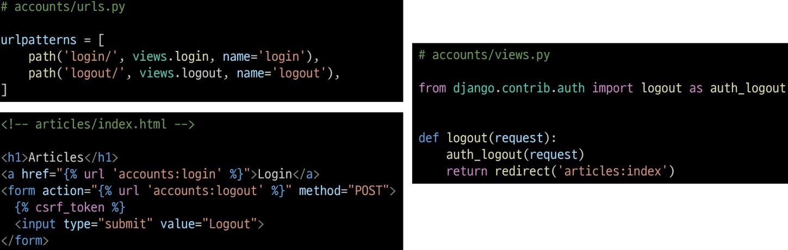
## AbstractUser class
관리자 권한과 완전한 기능을 갖고 있는 User model을 구현하는 추상 기본 클래스
- Abstract base classes: 몇가지 공통 정보를 다른 모델에 넣을 때 사용하는 클래스, DB 테이블을 만들 때 사용하지 않고 다른 모델의 기본 클래스로 사용되는 경우 해당 필드가 하위 클래스의 필드에 추가됨
- User 모델 상속 관계: models.Model > class AbstractBaseUser > class AbstractUser > class user
## 회원 가입
User 객체를 Create하는 과정
- UserCreatinoForm(): 회원가입시 사용자 입력 데이터를 받는 built-in ModerlForm  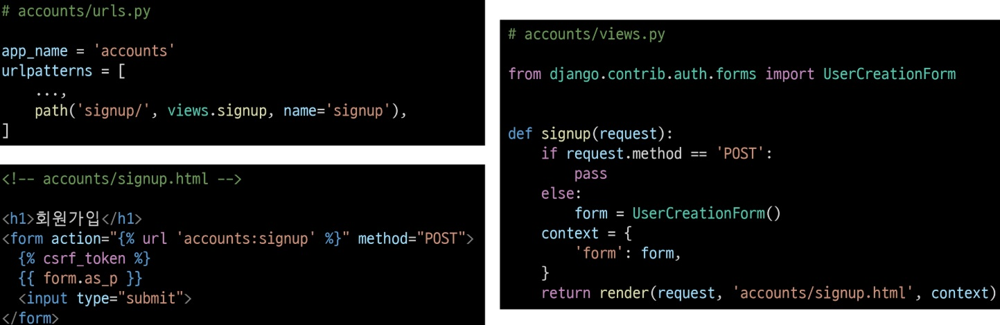  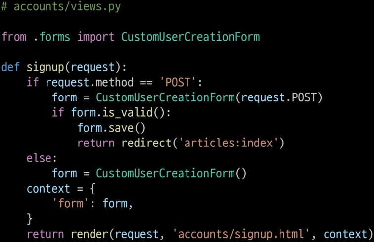
- UserCreatinoForm은 커스텀 모델이라 form을 바꿔줘야함  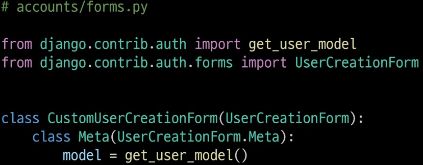
- get_user_model(): 프로젝트에서 활성화된 사용자 모델을 반환하는 함수
- 회원가입 후 로그인까지 바로 이어주려면 is_valid일 때 auth_login(request, user)
## 회원 탈퇴
User 객체를 Delete하는 과정
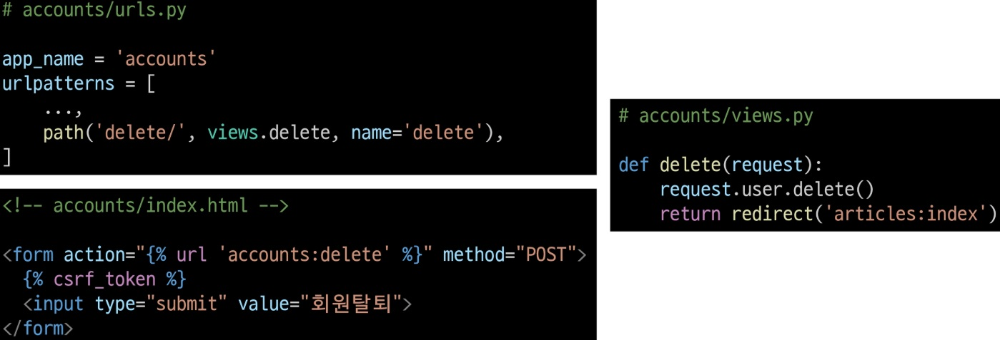
- 탈퇴 후 로그아웃 함수를 호출하면 Session Data 삭제 가능(순서가 바뀌면 해당 요청 객체 정보가 없어져 탈퇴할 유저 정보를 받을 수 없음)
## 인증된 사용자에 대한 접근 제한
1. is_authenticated: 사용자가 인증됐는지 여부를 알 수 있는 User model 속성
    - 인증 됐으면 항상 True 아니면 False
    - 메서드가 아니라 속성 값
2. login_required: 인증된 사용자에 대해서만 view 함수를 실행시키는 데코레이터
## 회원정보 수정
User 객체를 Update하는 과정
- UserChangeForm(): built-in ModelForm
- 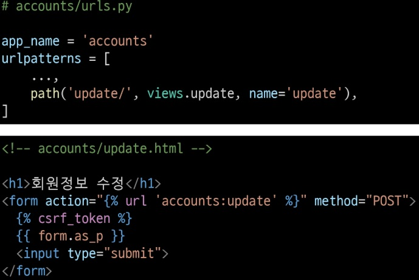
- 그냥 사용시 User 모델의 모든 Feild가 출력돼서 CustomUserChangeForm으로 출력 필드 조정  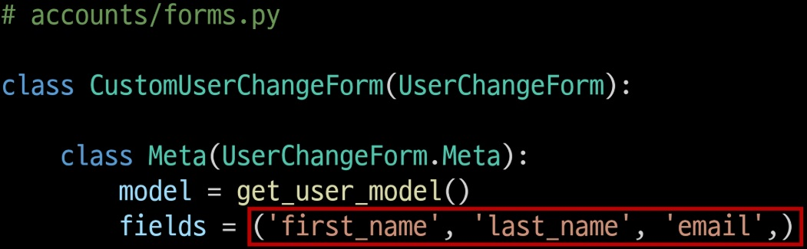
- 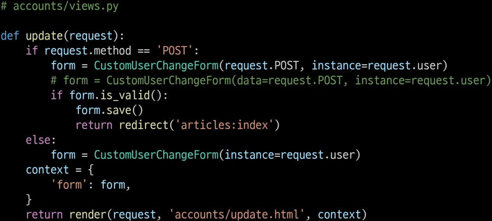
## 비밀번호 변경
사용자의 Session 데이터를 Update하는 과정
- PasswordChangeForm(): built-in Form
- 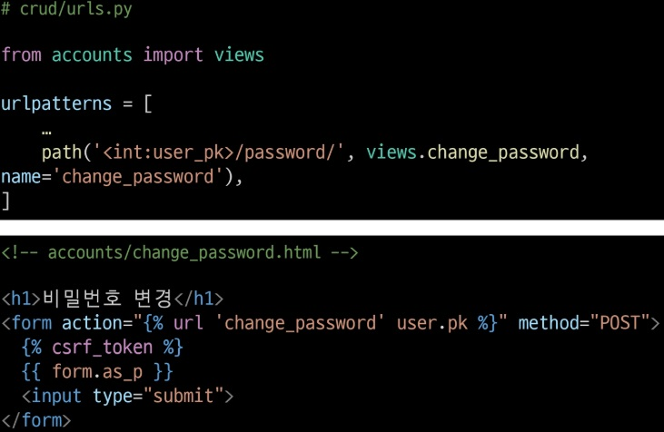  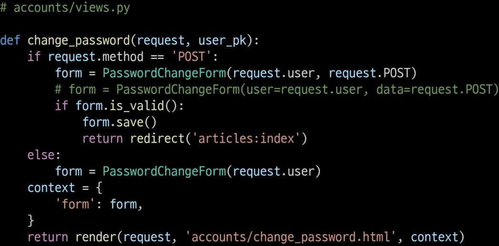
- update_session_auth_hash(request, user): 암호 변경시 기존 세션과 인증 정보가 달라 로그아웃 돼서 세션을 무효화해주는 함수  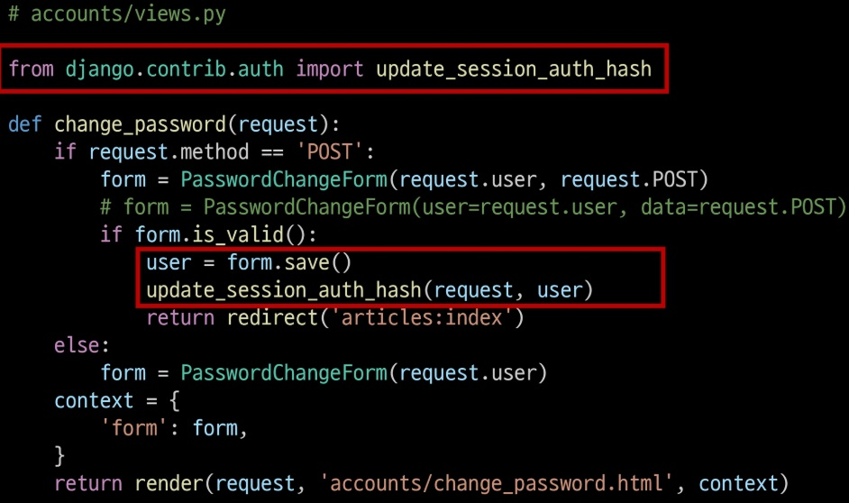
## 해시
비밀번호 암호화를 위해 임의의 크기를 가진 데이터를 고정된 크기의 고유한 값으로 변환
- 해시 함수: 입력 받은 데이터를 고정 길이(정수)로 변환해 주는 함수
    1. 어떤 길이의 데이터를 넣더라도 항상 고정된 길이의 결과물이 나옴(해시값)
    2. 입력된 값으로 해시값을 만들지만, 해시값을 보고 원래 입력값을 알아낼 수 없음(단방향)
    3. 입력값이 한 글자만 달라져도 해시값은 완전히 달라짐(눈사태 효과)
    4. 같은 입력값이라면 해시값은 항상 똑같음
- Django가 사용하는 함수는 SHA-256: 어떤 데이터든 256비트 길이로 변환
- 레인보우 테이블: 공격자가 자주 사용되는 비밀번호들을 미리 해시값으로 변환해둔 테이블
    - 솔트(Salt): 사용자마자 비밀번호에 입의의 문자열(솔트)을 붙여서 해시 암호화 진행
- 무차별 대입 공격: 완탐 공격
    - 키 스트레칭: 해시 연산을 수십만번 반복시켜 비밀번호 검증 과정을 일부러 느리게 만듦
- Django의 비밀번호 암호화
    1. algorithm: 어떤 알고리즘을 쓰는지
    2. iterations: 키 스트레칭 횟수
    3. salt: 생성된 솔트
    4. hash: 생성된 최종 해시
## 비밀번호 초기화
이메일을 활용해 비밀번호를 재설정
1. 비밀번호 찾기가 필요한 이메일 입력(password_reset/)
2. 이메일로 비밀번호 재설정 링크 전송(settings > EMAIL_BACKEND = 'django.core.mail.backends.condole.EmailBakend)
3. 비밀번호 재설정 페이지에서 새로운 비밀번호 설정