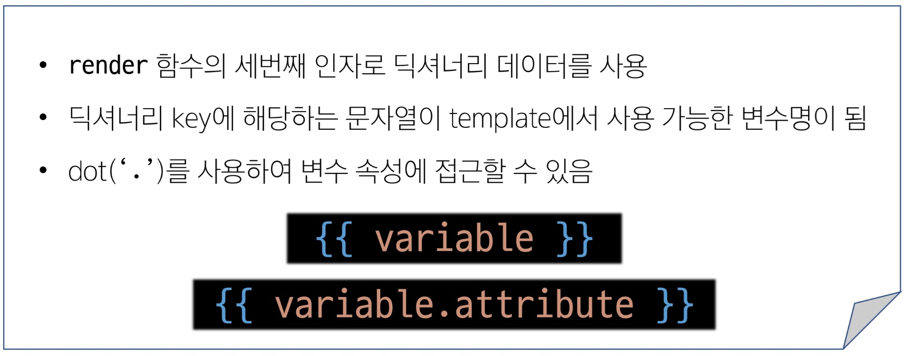
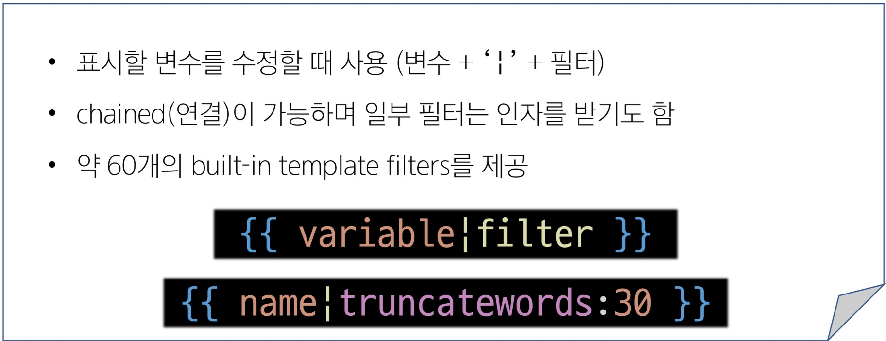
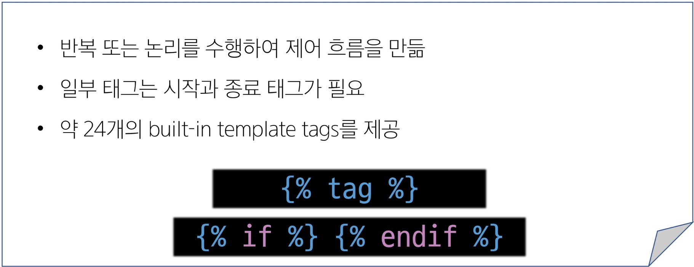
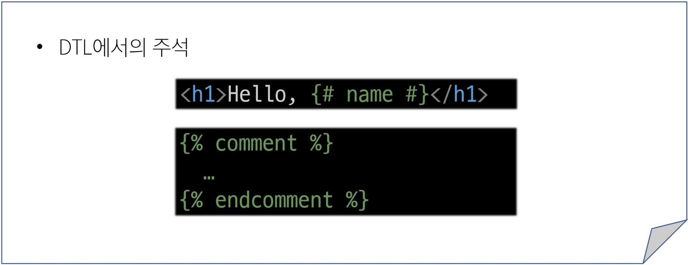
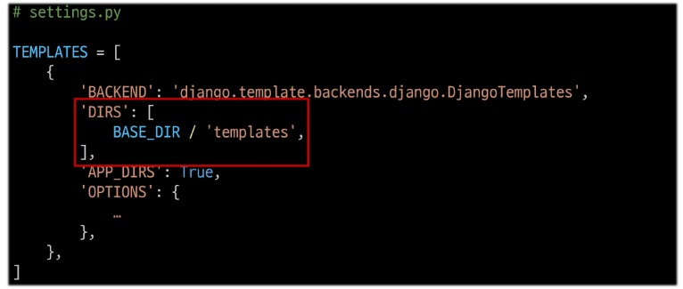
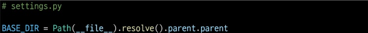

# Web application
Web application (web service) 개발
Client <-> Server

웹 페이지 보게 되는 과정(면접 많이 물어봄)  
google.com 입력 > domain주소(ip주소) 받아오기 > 인증서도 받아오고 이것 저것 많이 받아오기 3 way handshake?

## 가상환경
하나의 컴퓨터 안에서 또 다른 **'독립된'** 파이썬 환경  
두 패키지가 충돌하지 않게 하려고 만듬  
가상환경 비유
(Toptal): 친절한 사이트

### 의존성
하나의 소프트웨어가 동작하기 위해 필요로 하는 다른 소프트웨어나 라이브러리
- 의존성 패키지: 프로젝트가 의존하는 "개별 라이브러리"들을 가리키는 말, 프로젝트가 실행되기 위해 꼭 필요한 패키지들
1. 패키지 목록 확인: pip list
2. 의존성 기록: pip freeze > requirments.txt
의존성 패키기 관리가 필요한 이유: 

- 의존성 패키지 기반 설치: requirments.txt 를 활용해 동일한 패키지 버전을 설치하는 방법
    1. 가상환경 준비
    2. pip install -r requirment.txt

### 가상환경 주의사항 및 권장사항
1. 가상환경에 들어가고 나오는 것이 아니라 사용할 Python 환경을 On/Off로 전환하는 개념
2. 프로젝트마다 별도의 가상환경을 사용
3. 일반적으로 가상환경 폴더 venv는 관련된 프로젝트와 동일한 경로에 위치시킴
4. 폴더 venv는 .gitignore 파일에 작성되어 원격 저장소에 공유되지 않음

### 가상환경이 필요한 이유
1. 프로젝트마다 다른 버전의 라이브러리 사용
2. 의존성 충돌 방지
3. 팀원 간 협업

### 요약
1. 가상환경을 만든다
2. 가상환경을 활성화한다.
3. 필요한 의존성 패키지를 설치
4. 현재 환경의 모든 패키지 목록을 pip freeze > requirments.txt로 저장하여 의존성 관리
5. 다른 컴퓨터나 팀원도 같은 환경이 필요하다면, pip install -r requirment.txt로 동일한 버전의 라이브러리를 설치
6. 작업이 끝나면 deactivate로 가상환경을 비활성화

## Frontend
- Frontend
    - 사용자 인터페이스(UI)를 구성하고, 사용자가 애플리케이션과 상호작용할 수 있도록 함 : HTML, CSS, JavaScript, 프론트엔드 프레임워크 등


## Backend
- Backend
    - 서버 측에서 동작하며, 클라이언트의 요청에 대한 처리와 데이터베이스와의 상호작용 등을 담당: 서버 언어(파이썬, 자바 등) 및 백엔드 프레임워크, 데이터베이스, API, 보안 등

### Famework
- Web Framework: 웹 애플리케이션을 빠르게 개발할 수 있도록 도와주는 도구(기본 구조, 규칙, 라이브러리 등을 제공)
인기있는 Backend Framework:
    - Express.js (Node.js)
    - Django (Python)
    - Spring Boot (Java)
    - Laravel (PHP)
    - ASP.NET Core (C#)
    - Flask
    - FastAPI

#### Django
파이썬 기반의 대표적인 웹 프레임워크
```bash
장고를 사용하는 이유
- 다양성: Python 기반으로 웹, 모바일 앱 백엔드, API 서버 및 빅데이터 관리 등 광범위한 서비스 개발에 적합
- 확장성: 대량의 데이터에 대해 빠르고 유연하게 확장할 수 있는 기능을 제공
- 보안: 취약점으로부터 보호하는 보안 기능이 기본적으로 내장되어 있음
- 커뮤니티 지원: 개발자를 위한 지원, 문서 및 업데이트를 제공하는 활성화 된 커뮤니티
```

- 프로젝트 생성 및 서버 실행
    1. 프로젝스 생성: django-admin startproject firstpjt .
    2. 서버 실행: python manage.py runserver

##### Django Design Pattern
디자인 패턴: 소프트웨어 설계에서 발생하는 문제를 해결하기 위한 일반적인 해결책(공통적인 문제를 해결하는 데 쓰이는 형식화 된 관행) > 애플리케이션의 구조는 이렇게 구성하자 라는 관행

```bash
아키텍쳐 디자인 패턴(애플리케이션 구조화하는데 쓰는 패턴):
- MVC(Model, View, Controller) 디자인 패턴: 애플리케이션을 구조화하는 대표적인 패턴(데이터 & 사용자 인터페이스 & 비즈니스 로직을 분리)
    - 자바 프레임워크(스트링) 에서 쓰는 패턴?
    - 시각적 요소와 뒤에서 실행되는 로직을 서로 영향 없이, 독립적이고 쉽게 유지 보수할 수 있는 애플리케이션을 만들기 위해
- MTV(Model, Template, View) 디자인 패턴: Django에서 애플리케이션을 구조화하는 패턴(기존 MVC 패턴과 동일하나 단순히 명칭을 다르게 정의한 것)
    - Django에서 쓰는 패턴?
    - View > Template, Controller > View 단순한 명칭 변경
디자인 패턴:
- 싱글톤
```
- 프로젝트: 애플리케이션의 집합(DB 설정, URL 연결, 전체 앱 설정 등을 처리)
    - 프로젝트 구조
        1. settings.py
        2. urls.py
        3. __init__.py
        4. asgi.py
        5. wsgi.py
        6. manage.py
- 앱: 독립적으로 작동하는 기능 단위 모듈(각자 특정한 기능을 담당하며 다른 앱들과 함께 하나의 프로젝트를 구성)
    - 앱 구조
        1. admin.py
        2. models.py
        3. views.py
        4. apps.py
        5. tests.py
1. 앱 생성: python manage.py startapp articles(앱의 이름은 '복수형'으로 지정하는 것을 권장)
2. 앱 등록: 반드시 앱을 생성한 후에 등록해야 함(등록 후 생성은 불가능) settings.py에 드가서 등록

##### Template System
- Django Template System: 데이터 표현을 제어하면서, 표현과 관련된 부분을 담당
- Django Template Launage: Templates에서 조건, 반복, 변수 등의 프로그래밍적 기능을 제공하는 시스템
    - DTL Syntax:
    1. Variable: 
    2. Filters: 
    3. Tags: 
    4. Comments: 
    - 주의사항: 파이썬 함수(if for) 등을 사용할 수 있지만 그렇게 설계했을뿐 파이썬과 관련 없음, 되도록 view 함수에서 작성 및 처리
- 템플릿 상속(Template inheritance):
    **페이지의 공통요소를 포함**하고, **하위 템플릿이 재정의 할 수 있는 공간**을 정의하는 'skeleton' 템플릿을 작성하여 상속 구조를 구축
    - extends tag: 자식 템플릿이 부모 템플릿을 확장한다는 것을 알림(자식 템플릿 최상단에 작성되야함)
    - block tag: 하위 템플릿에서 재정의 할 수 있는 블록을 정의(base.html: 상위 템플릿에 작성)
---
##### 요청과 응답
- HTML form: 사용자가 HTTP 요청을 서버에 보내는 가장 편리한 방법(from tag)
    - form element: 사용자로부터 할당된 데이터를 서버로 전송(text, password, checkbox 등)
    - form 핵심 속성:
        1. action: 입력 데이터가 전송될 URL 지정(default: form이 있는 페이지의 URL)
        2. method: 데이터를 어떤 방식으로 보낼지 정의
            - GET: 데이터 조회 / POST: 데이터 변경, 수정, 생성
        3. input: 사용자의 데이터를 입력(속성 값에 따라 다양한 유형의 입력 데이터를 받음)
            - 'name': input의 핵심 속성, 사용자가 입력한 데이터에 붙이는 이름(KEY),  
            데이터를 제출했을 때 서버는 name 속성에 설정된 값으로만 입력한 데이터에 접근할 수 있음
    - Query String Parameters:
        - 사용자의 입력 데이터를 URL 주소에 파라미터를 통해 서버로 보내는 방법
        - 문자열은 '&'로 연결된 key=value 쌍으로 구성, 기본 URL과는 '?'로 구분됨

##### Django URL
- URL dispatcher: URL 패턴을 정의하고 해당 패턴이 일치하는 요청을 처리할 view 함수를 연결
- Variable Routing: URL 일부에 변수를 포함시키는 것<path_converter : variable_name> ex)path('articles/<int:num>/', views.detail)
    - str, int, slug(알파벳, 숫자, -, _ 로 구성된 문자열), uuid(-를 포함하고 모든 문자가 소문자), path(str은 / 하나씩, path는 전체 경로 한번에)
- App URL: 각 앱에 URL을 정의(프로젝트와 각 앱이 URL을 나누어 관리를 편하게 하기 위함, include 사용)
    - include(): 프로젝트 내부 앱들의 URL을 참조할 수 있도록 매핑하는 함수
    - 구조 변경에 따른 문제점: include한 주소 url에 가서도 다 변경해줘야함
        - 해결법(Naming URL patterns): URL에 이름을 지정해줌
    - 이름 지정 후 문제점: 이름이 중복될 수 있음
        - 해결법(app_name 속성 지정)
    - url 태그의 최종변화 = 
- 템플릿 경로 지정: 템플릿 기본 경로 외 커스텀 경로 추가하기, 템플릿을 아예 밖으로 꺼내두기
    
    BASE_DIR 위치:

##### MODEL
DB의 테이블을 정의하고 데이터를 조작할 수 있는 기능들을 제공(테이블 구조를 설계하는 청사진)