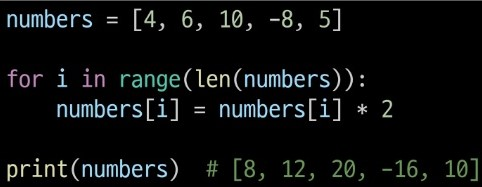
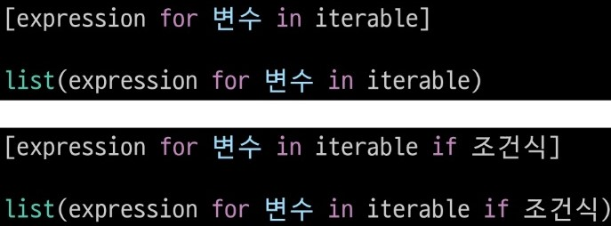

# 제어문(*중요*)
    - 코드의 흐름을 제어, 조건에 따라 코드 블록 실행 or 반복 실행
- 조건문
    - if (표현식:): 참이면 코드 블록 실행
    - elif (표현식:): 위가 F일 때, 얘가 참이면 실행
    - else (:): 위 조건문이 다 F면 실행
- 반복문
    - for (변수 in 반복 가능한 객체:): 
        - 반복 가능한 객체: 형식 전부 다
        - 문자열 순회: ex) str 형식이면 하나하나 s,t,r
        - range: ex) range(5): 0,1,2,3,4 출력
        - 딕셔너리 순회: 
        - 인덱스로 리스트 순회: 
        - 중첩 반복문: 안에 드간 반복문 끝나야 위에 반복문으로 돌아감
        - for else: for if 안에 break가 한번도 안되면 for else에 있는 코드블록 실행
    - while (조건식): 조건식이 f가 될 때까지 반복, 반드시 종료 조건 필요
    - for는 반복 횟수가 정해져 있을 때, while은 조건에 따라 반복을 종료해야 할 때 사용
- List Comprehension(알고만 있으면 됨): 간결하고 효율적인 리스트 생성법
    - 
    - 
    - 
- enumerate(자주 사용, iterable, start=0): iterable 객체의 요소에 인덱스와 함께 반환하는 내장함수[1](image/enumerate.jpg)
- 반복문 제어
    - break: 반복 즉시 정지
    - continue: 다음 반복으로 건너뛰기
    - pass: 아무 작업도 안하고 넘어감, 임시로 pass 적어두기
