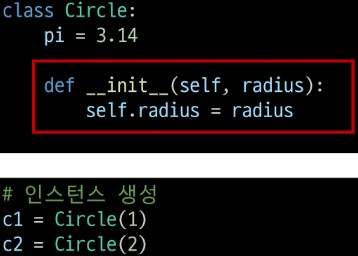
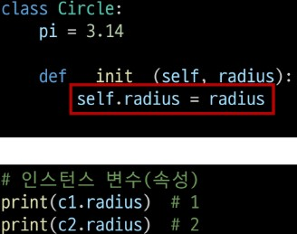
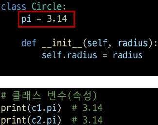

# 프로그래밍 패러다임
## 절차 지향 프로그래밍
- 데이터를 다시 재사용 하기보다는 처음부터 끝까지 순서대로 실행
- 한계: 복잡성 증가
    - 규모가 커질수록 데이터, 함수 관리 어려움(스파게티 코드: 겁나 꼬여서 쓸애기 코드)
## 객체 지향 프로그래밍
- 데이터와 함수를 하나의 단위(객체)로 묶어서 관리
- 객체들을 조합하고 재활용하는 방식으로 프로그램 구성
## 객체
- 사물을 추상화한 것, 속성과 동작을 가짐
- 특징: 속성(객체의 상태/데이터), 메서드(행동/기능), 고유성
## 인스턴스
- 클래스로 생성된 객체
## 클래스
- 객체를 만들기 위한 설계도
- 데이터, 기능을 하나의 틀로 묶어 관리
- 파이썬에서 타입을 표현하는 방법
- 클래스로 여러 개의 객체를 쉽게 만들 수 있음
- 클래스 이름은 파스칼 케이스로 작성
- 클래스를 만든다 == 타입을 만든다
	### 구조
	- 생성자 메서드:--init--, 인스턴스 생성시 자동 호출되는 메서드, 인스턴스 변수 초기화 담당
	- 인스턴스 변수(속성): 인스턴스별 고유한 속성, self.변수명 형태, 인스턴스마다 독립적인 값 유지
	- 클래스 변수(속성): 모든 인스턴스가 공유하는 속성, 클래스 내부에서 직접 정의
	- 클래스 변수와 동일한 이름으로 인스턴스 변수 생성 시 인스턴트 변수에 먼저 참조하게 됨
# 메서드
- 클래스 내부에 정의된 함수, 객체가 어떻게 동작할지 정의
	1. 인스턴스 메서드: 각 인스턴스에서 호출할 수 있는 메서드, 인스턴스의 상태 조작/동작 수행
		- 구조: 클래스 내부에 정의되는 메서드의 기본, 반드시 첫번째 인자는 self, 인스턴스 속성에 접근하거나 변경 가능
		- 생성자 메서드:--init--, 인스턴스 생성시 자동 호출되는 메서드, 인스턴스 변수들의 초기값 설정
			- 매직 메서드: __가 있는 메서드는 특수 동작을 위해 만들어진 메서드, 특정 상황에 자동으로 호출
	2. 클래스 메서드: 클래스가 호출하는 메서드, 클래스 변수를 조작하거나 클래스 레벨의 동작을 수행
		- 구조: @classmethod 데코레이터로 정의, 호출시 첫번째 인자는 cls, 클래스를 인자로 받아 클래스 속성을 변경하거나 읽는데 사용
	3. 스태틱(정적) 메서드: 클래스, 인스턴스와 상관 없이 독립적으로 동작하는 메서드
		- 구조: @statucmethod 데코레이터로 정의, 호출시 자동으로 받는 인자가 없음, 도우미 함수와 비슷한 역할
- 데코레이터: 다른 함수의 코드를 유지한 채로 수정하거나 확장하기 위해 사용되는 함수

# 상속
- 한 클래스의 속성과 메서드를 다른 클래스가 물려받는 것(부모>자식)
- 필요한 이유:
  1. 코드 재사용: 기존 클래스의 속성과 메서드 재사용 가능, 기존 클래스를 수정 안하고도 기능 확장 가능
  2. 계층 구조: 클래스 들의 계층 구조 생성 가능, 클래스들간의 관계를 표현하고 더 구체적인 클래스 만들 수 있음
  3. 유지보수의 용이성
- 상속 없이 구현하는 경우: 정보를 별도로 표기하고 어려움, 메서드 중복 정의될 수 있음
## 메서드 오버라이딩(Method Overriding) (오버로딩 python에서는 구현 ㄴ)
  - 오버라이딩 중요
  - 자식 클래스가 부모 클래스의 메서드를 재정의
  - 다중 상속 하면 자기부터 올라가서 출력
  - 다이아몬드 문제: MRO 알고리즘, 부모 클래스부터 상속된 속성들을 깊이우선>왼쪽에서 오른쪽>계층 구조에서 겹치는 같은 클래스 검색하지 않음 ex) class D(B, C) D에서 발견되지 않으면 B 그 다음 C
  - super() 부모 클래스(상위 클래스) 메서드를 호출하기 위해 사용하는 내장 함수
    - 단일 상속 구조: 코드를 유지관리하기 쉽게 만들어줌, 클래스 이름 변경 or 부모 클래스 교체 돼도 코드 수정이 더 적게 필요
    - 다중 상속 구조: MRO를 따른 메서드 호출, 복잡한 구조에서 발생할 수 있는 문제 방지

# 에러와 예외
## 버그와 디버깅
- 디버깅 방법
  1. print 함수 활용
  2. 개발 환경(text editor, IDE) 등에서 제공하는 기능 활용/ breakpoint, 변수 조회 등
  3. Python tutor 활용(단순 파이썬 코드)
  4. 뇌 컴파일, 눈 디버깅 ㅋㅋ
## 에러
  - 문법 에러: 프로그램 구문이 올바르지 않은 경우=빨간줄
    1. invalid syntax(문법 오류)
    2. assign to literal(잘못된 할당)
    3. EOL(End of Line)
    4. EOF(End of File)
  - 예외: 프로그램 실행 중 감지되는 에러
  - 내장 예외: 예외 상황을 나타내는 예외 클래스들, 파이썬에 정의되어 있고 특정 상황에 대처하기 위해 사용
    1. ZeroDivisionError: 나누기 또는 모듈로 연산의 두 번재 인자가 0일때 발생
    2. NameError: 지역 또는 전역 이름을 찾을 수 없을 때 발생
    3. TypeError: 타입 불일치, 인자 누락, 인자 초과, 인자 타입 불일치
    4. ValueError: 연산이나 함수엔 문제 없지만, 인자 값이 부적절하고 더 구체적 예외가 아닌 경우
    5. IndexError: 시퀀스 인덱스가 범위를 벗어날 때 발생
    6. KeyError: 딕셔너리에 해당 키가 존재하지 않는 경우
    7. ModuleNotFoundError: 모듈을 찾을 수 없는 경우
    8. InportError: import하려는 이름을 찾을 수 없는 경우
    9. KeyboardInterrupt: 사용자가 Con-C or Delete 누를 때 발생 / 무한루프 시 강제 종료
		10. IndentationError: 잘못된 들여쓰기와 관련된 문법 오류
## 예외처리
 - try: 코드 작성
 - except: 예외가 발생하면 실행할 코드 작성 | 반드시 하위 클래스부터 확인해야 전부 확인 가능
 - else: 예외가 발생하지 않으면 실행할 코드 작성
 - finally: 상관없이 항상 실행할 코드 작성
 - as 키워드: except (에러코드) as (변수명): 하면 에러코드를 error에 저장 가능 ex) print로 확인 가능
 - try-except와 if-else 같이 사용할 수 있음 (try>if>else>except)