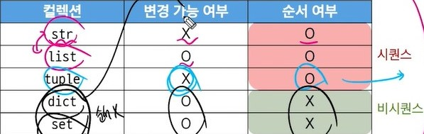

## 프로그래밍 언어
고수준 언어: 인간이 읽기 쉬움(python, java  )
인터프리터(번역기) VVV
저수준 언어: 어려움(기계어, 어셈블리어)
## 파이썬
- 귀도 반 로섬(Guido van Rossum)이 심심해서 만든 언어
- 쉽고 간결한 문법
- 커뮤니티가 커서 정보 찾기가 좋음
- 응용 분야가 광범위
- 다양한 유명 기업에서 활용됨(구글, 페북, 넷플 NASA등), 다양한 현장에서 사용되는 언어
- 알고리즘도 구현하기 쉬움, 파이썬 사용 가능하면 문제들 다 파이썬으로 풀기
- 3+5(표현식) =(평가) 8(결과값)
- 연산자 우선순위 **(지수) > -(음수 부호) > +, /, //, %(사칙연산) > +, -(덧셈, 뺄셈)  
**변수**: 값을 저장하기 위한 이름  
값을 저장하면 메모리에 집어넣고 출력할 때는 그 값의 메모리주소를 갖고온다
id(): 메모리 주소 확인
## type **중요**
- 변수나 값이 가질 수 있는 데이터의 종류
- 타입은 값과 연산자 2가지 요소로 이루어짐
- int(정수): 0b:2진수 0o:8진수 0x:16진수
- float(실수): 컴퓨터가 값을 2진수로 바꿔서 저장함  
부동소수점 에러: 소수점을 쭉 길게 빼서 저장해서 3.2 - 3.1, 1.2-1.1이 다르다고 나옴, **from decimal import decimal** / Decimal('3.2') - Decimal('3.1') = 0.1 요런식으로 하면 똑같아짐  
### Sequence(여러 값들을 순서대로 나열해서 저장)
1. 인덱싱: 각 값에 고유한 번호(인덱스)가 있어서 특정 위치, 값 선택 / 수정 가능
2. 슬라이싱: 범위 조절해서 값 추출 가능
3. 길이: len()로 길이 구할 수 있음
4. 반복: 함수로 반복해서 출력 가능
- str(문자열): ('',""), 값이 아닌 문자만, 변경 불가능한 자료형
- f-str : 문자열에 f''를 붙이고 작성, 파이썬 표현식의 값을 삽입할 수 있다
\n : 줄바꿈, \t: 탭, \\: 백슬래시, \': 작따 \": 큰따  
인덱싱: (변수[숫자]): 하면 그 위치 값 나옴  
슬라이싱: (변수[시작점:여기 직전까지:몇칸씩])  
길이: len(변수)  
바꿀라면 다른 변수에 그 값을 저장해주고 그 변수를 출력
- list: []로 표현, 변경 가능한 자료형, 어떤 자료형도 저장 가능  
arr = [abcde] 하면 a주소, b주소=a주소+8, ...  
- tuple: ()로 표현, 여러 값을 순서대로 저장, (, 꼭 넣어야함)list랑 다 똑같은데 변경 불가능  
다중 할당: x, y = 10, 20 (같은 튜플이라 그냥 됨)
값 교환: x, y = 1, 2 / x, y = y, x 해버리면 바뀜  
그룹화: student = (1, 2, 3) / a, b, c = student / print(a, b, c) = 1, 2, 3
- range: 정수를(정수로만) 순서대로 저장, 변경 불가능, range(시작 값, 끝 값, 증가 값), for랑 짝꿍
### Non-Sequence(순서 없는 친구)
- dict: ({}로 저장)'Key' = Value 쌍으로 이루어진 순서, 중복이 없는(똑같은 거 만들 수 없음) 변경 가능한 자료형  
ex = {'apple': 12, 'list': [1,2,3]}
    print(ex['apple']) = 12
    * key = 변경 불가능한 자료형만 사용 가능(str, int, float, tuple, range, ...)
    * value = 모든 자료형 사용 가능  
from collections import defaultdict(변수형): 없는 키값을 입력해도 기본값이 나옴
- set: 순서, 중복이 없는 변경 가능한 자료형 (집합 느낌이라 순서가 없음)
    set = {같은 거 넣으면 하나만 저장됨}  
    합집합: |, 차집합: -, 교집합: &
- None: 값이 없다.
- Boolean: True or False로만 표현, 조건/반복문과 함께 사용, 0, 빈 값 이 아니면 전부 True
# 정리
- 
## type conversion
- 암시적 형변환: 파이썬이 자동으로 형변환, 더 큰 변수형으로 바뀜
- 명시적 형변환: 프로그래머가 직접 형변환, 암시적 아닌 모든 경우 **웬만하면 이걸로**
## 연산자
- 산술 연산자: 기본 연산자 + //(몫), %(나머지), **(거듭제곱)
- 복합 연산자:
    a+=b : a = a+b/-=, *=, /=, //=, %=, **=
- 비교 연산자: !=: 같지 않음, is:주소 값이 같음, is not:주소 값이 다름
- 논리 연산자: and, or, not
- 단축 평가:
    * and: false 만나면 그 전 결과값 출력
    * or: true 나오면 바로 그 값 출력
- 멤버쉽 연산자: in, not in
- 시퀀스형 연산자: +, *