아 여기 뭐 써있었드라

아 ChatGPT랑 등등

# ChatGPT:
### Generative AI: 생성모델  
- 콘텐츠 생성해주는 인공지능 모델
### Pre-trained: 사전훈련
- 거대 언어 모델 + 추가 학습 데이터 + 추가 강화 학습
### Transformer: 트랜스포머 AI 모델
- 문장 속 단어간 관계 파악, 맥락과 의미 연습
- 일관되고 연관성이 높은 언어를 구사해 대화형 작업에 강점
- (Neural Network Architecture): Attention 매커니즘  
#### Tramsformer 주요 개념: 
- Self-Attention 매커니즘  
    - 입력 데이터 간의 관계와 중요도를 계산
- 병렬 처리 가능
    - RNN과 달리 순차 처리가 필요 없어 속도가 빠름
- 스케일링 가능
    - 대규모 데이터 및 파라미터로 확장 가능  
**GPT모델**은 특히 디코더 부분만을 사용
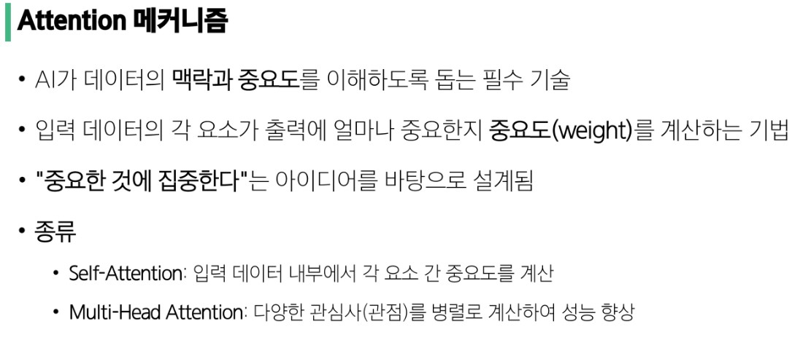
# API
## Interface
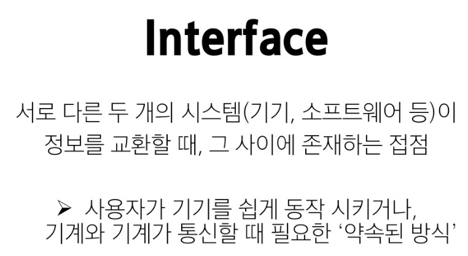
UI(User interface): 그래픽, 화면적 요소
## CS
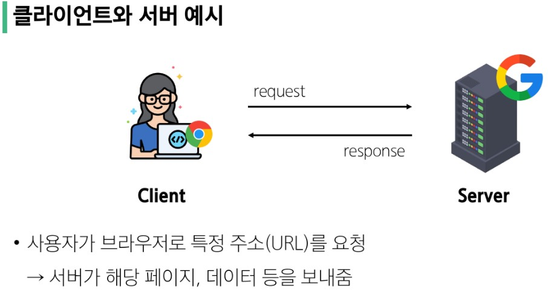
공부할 거 겁나 많다고 하심 ㅠ
## API, API key
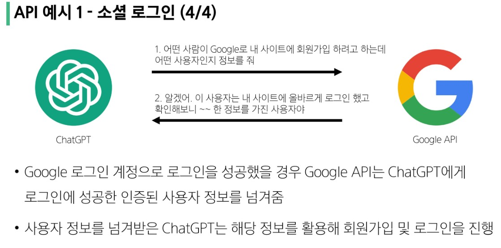
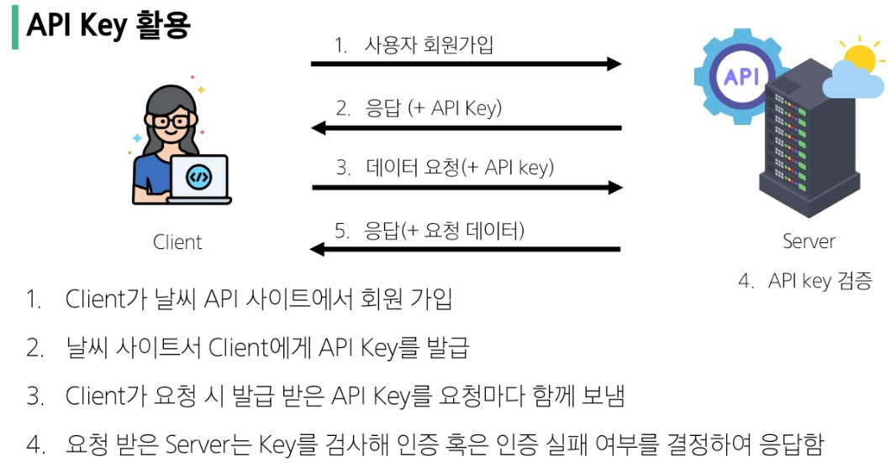
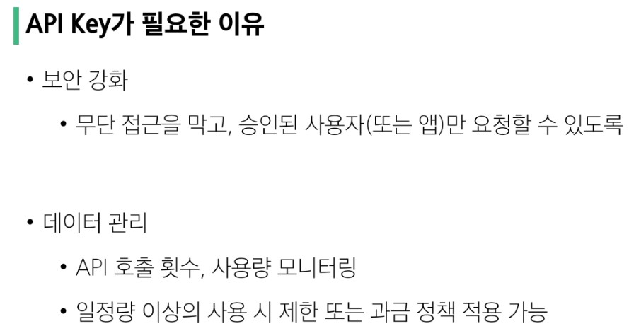
## Prompt Engineering
prompt로 하는 AI랑 놀기 쪼꼼 재밌음
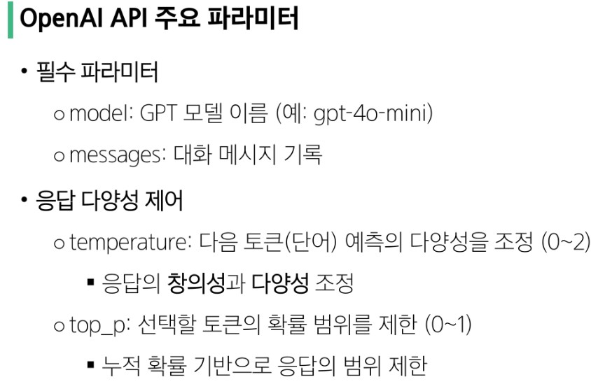
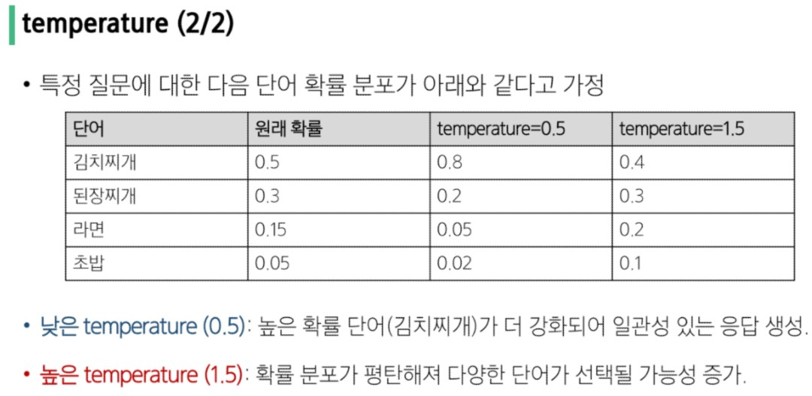
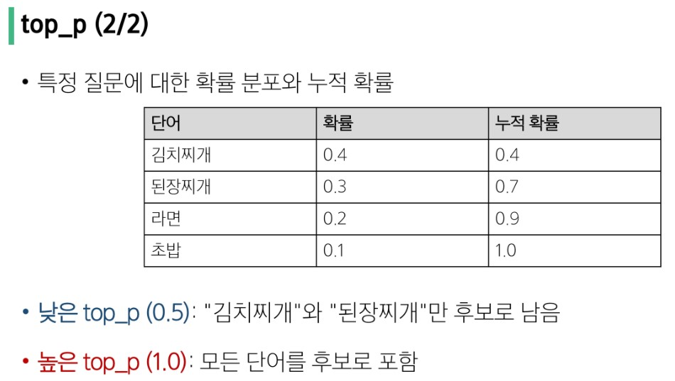
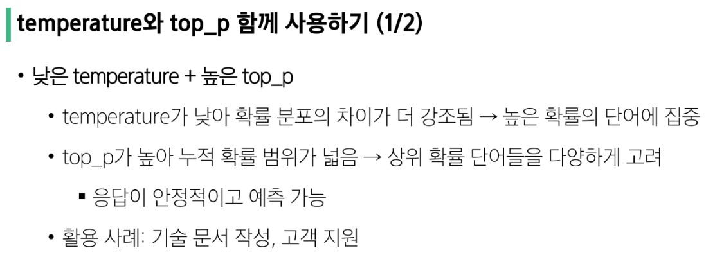
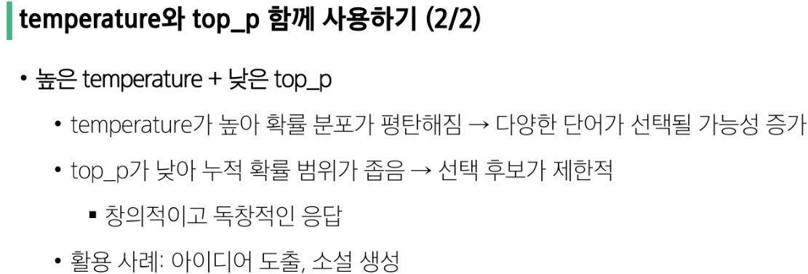
## 바이브 코딩
그냥 말하는대로 다 만들어줌, 자세하게 말할수록 좋음
