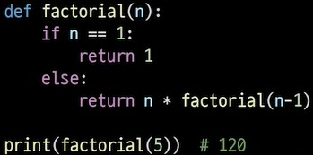

# 참고 사이트
![코딩도장: https://dojang.io/course/view.php?id=7]  
![코드솔: https://codesol.how-to.best/doc/python]  
# input
"원하는 변수형"(input())  
input() 하면 리스트로 저장  
map(변수형,input().split()): 입력한 거 차례대로 넣고 변수형으로 바꾸기  
# 내장함수
- sum,max,min,len,sorted(정렬)
- map(funtion, iterable)/변수 = map(원하는 변수형,입력값):입력값들을 원하는 변수형으로 바꿔서 변수에다 넣어둠, 변수 = map(함수, 입력값): 변수에다가 입력값에 함수 적용한 값들을 넣어둠
- zip(*iterables): 변수=zip(변수1,변수2):변수1,변수2에 있는 값들을 세로로 묶어서 tuple로 반환(짧은 친구 기준, 남은 거 버림)
- in: 리스트 내에 원소가 존재하는지 확인하는 함수(if 3 in my_list: print("3 is in my_list)), 다양한 시퀀스 자료형에서 사용 가능
제너레이터라는 게 있다
# print
print(x+"변수 뒤에 뭐 붙여서 출력하려면 + 쓰기")
안에 + end" " 안에 내용들 사이에 " " 값 넣어서 출력
# 함수 만들기
- 함수: 재사용 가능한 코드 묶음
- def(함수 정의) 함수 이름(동사+명사)(괄호 안에 매개변수 정의 가능):  
    - 함수 body: 코드 블록 함수가 실행되면 수행되는 코드
    - 반환 값: 필요한 경우 결과를 반환, return 뒤에 반환할 값을 명시, 함수 실행을 종료한 후 결과를 호출 부분에 반환
    - 매개변수: 함수가 받을 값을 나타내는 변수 def 함수이름(매개변수)
    - 인자: 함수 호출할 때 드가는 값 변수 = 함수(인자)
        - 위치 인자: 자릿수 맞추기
        - 기본 인자값: 매개변수에 디폴트 값 넣어두면 호출시 인자를 전달 안해도 기본값이 출력 /def ex(1, 2=default)
        - 키워드 인자: 인자 칸에 매개변수=값 으로 넣기 /def ex(1, 2)이거 있으면 아래에서 def(1=어쩌구,2=저쩌구), 위치인자 뒤에 있어야함
        - 임의의 인자 목록: 정해지지 않은 개수의 인자 처리, 매개변수 앞에 * 붙이기, 여러 개의 인자를 **tuple(,)**로 처리 
        - 임의의 키워드 인자 목록: 정해지지 않은 개수의 키워드 인자 처리, 매개변수 앞에 ** 붙이기, 여러 개의 인자를 **dictonary**로 처리
- 함수 호출: 변수=함수이름(매개변수)로 호출, 호출 부분에서 전달된 인자는 함수 정의시 작성한 매개변수에 대입
- 재귀 함수: 함수 안에서 계속 자기 자신을 호출하는 함수
    - 팩토리얼(n!): 어떤 양의 정수 n에 대해서 1부터 n까지 모든 양의 정수를 곱한 값, n이 0이 될때까지 반복되니 종료 조건 설정 꼭, 반복되는 호출이 종료 조건을 향해서 가게 만들기
    - 
        - 특징: 변수를 줄이고 가독성이 높아짐, 1개 이상의 종료되는 상황이 정의
        - 이유: 문제의 자연스러운 표현, 코드 간결성, 수학적 문제 해결
- 람다: 변수 = lambda 매개변수 : 표현식 , 이름 없이 def 없이 익명 함수
# scope
- python의 범위(scope): 함수는 코드 안에 local scope를 만들고 나머지 영역은 global scope로 구분
    - global scope: 코드 어디에서든 참조할 수 있는 공간, global variable: 여기 정의된 변수
    - local scope: 함수가 만든 scope(함수 안에서만 참조 가능), local variable: 여기 정의된 변수
- 변수 수명 주기: 변수가 선언되는 위치와 scope에 따라 결정됨
    - built-in scope: 정의하지 않고 사용할 수 있는 것들, 원래 있는 함수들(print), 끝까지 사라지지 않음
    - global scope: 최상단 범위, 함수 바깥에 a=1, b=1 같은 친구들, 계속 유지된다고 보면 됨
    - Endosed scope: local scope 바로 윗 단계 (함수안에 함수 만들면 그 위에 있는 친구)
    - lcoal scope: 함수 안에 있는 친구들, 함수가 호출될 때 생성되고 함수가 종료되면 같이 끝남
- 이름 검색 규칙: 아래 scope 에서 위로 접근은 가능하지만 수정은 불가능, LEGB Rule
- global keyword:
    - 변수의 스코프를 전역 범위로 지정하려고 사용
    - 함수 내에서 전역 변수 수정하려는 경우에 사용 [1](image/글로벌키워드.jpg)
    - global 키워드 선언 전에는 참조 불가능
    - 매개변수에는 global 키워드 사용 불가
## 함수 이름 정의
- 소문자,_,동사로 함수 동작 설명, 약어 지양, 동사+명사, 동사+형용사+명사, get/set 접두사
- 명확한 목적을 가진 함수, 그 목적에 맞는 동작만 수행
# 패킹, 언패킹
- 패킹: 여러 값을 하나의 변수에 묶어서 튜플로 담기
- *로 패킹하기: [1,2,3,4,5] 에서 a, *b, c하면 1 2,3,4 5 / *a,b,c 하면 1,2,3 4 5
- 언패킹: 패킹된 변수들을 튜플이나 리스트 개별적인 변수로 분리
- *로 언패킹하기: 리스트의 요소를 언패킹해서 인자로 전달 
- **로 언패킹: 딕셔너리의 키-값을 언패킹하여 함수의 인자로 전달
# 모듈
- 다른 사람이 만들어둔 변수+함수 갖고오기(import 모듈)/from으로 특정 함수만 가져오기도 가능한데 복잡해짐/(모듈.함수) 모듈에서 함수를 찾아라
- as 키워드: 2개 이상의 모듈에서 이름이 같은 변수, 함수가 있으면 별명으로 만들어서 사용
# 파이썬 표준 라이브러리
## 패키지
- 패키지 안에 모듈 여러개(from 패키지 이름 import 모듈 이름)
- 파이썬 표준 라이브러리 내부 패키지는 import로 바로 사용
- 외부 패키지는 pip로 설치하고 import(pip install 패키지 이름/최신/특정버전==버전/최소 버전>=원하는 최소 버전)