# Web
Web site: 여러 웹 페이지가 하나로 모인 공간  
web page: HTML, CSS 등 웹 기술로 만들어진, Web site의 구성요소
- Web page 구성 요소: HTML(Structure) / CSS(Styling) / Javascript(behavior)

## HTML
Hyper Text Markup Language: 웹 페이지의 의미와 구조를 정의하는 언어  
Hyper Text: 웹 페이지를 다른 페이지로 연결하는 링크
```bash
- 참조를 통해 사용자가 한 문서에서 다른 문서로 즉시 접근할 수 있는 텍스트
- 비선형성, 상호연결성, 사용자 주도적 탐색
```
Markup Language: 태그 등을 이용해 문서나 데이터의 구조를 명시하는 언어
```bash
- 인간이 읽고 쓰기 쉬운 형태, 데이터의 구조와 의미를 정의하는 데 집중
ex) HTML, Markdown
```
---
### HTML 구조
```bash
<!DOCTYPE html>: 해당 문서가 html로 작성된 문서라는 것을 나타냄
<html></html>: 전체 페이지의 콘텐츠를 포함
<title></title>: 브라우저 탭, 즐겨찾기 시 표시되는 제목으로 이용
<head></head>: HTML 문서에 관련된 설명, 설정 등 컴퓨터가 식별하는 메타데이터 작성 / 사용자에게 보이지 않음
<body></body>: HTML 문서의 내용 / 페이지에 표시되는 모든 콘텐츠 작성 / body는 단 하나만 존재
<p></p>: Paragraph 텍스트 문단을 만드는 태그
<a></a>: Anchor 다른 페이지로 이동시키는 하이퍼링크 태그
: image src에 지정된 그림을 보여주는 태그 (alt는 이미지가 깨졌을 때 표기할 내용)
```
---
### HTML Elements (요소)
하나의 요소는 **여는 태그, 닫는 태그, 내용**으로 구성됨  
닫는 태그는 태그 이름 앞에 /슬래시가 포함(닫는 태그가 없는 태그도 존재)

---
### HTML Attributes (속성)
사용자가 원하는 기준에 맞도록 요소를 설정하거나 요소의 동작을 조절하기 위한 값  
목적:
- 페이지에 나타내고 싶진 않지만 추가적인 기능, 내용을 담고 싶을 때 사용
- CSS에서 스타일 적용을 위해 해당 요소를 선택하기 위한 값으로 활용  
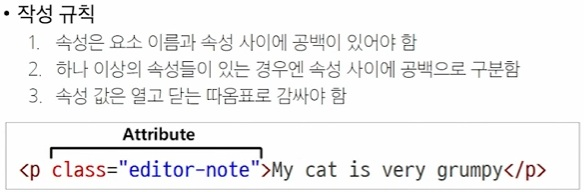
---
### HTML Text Structure
HTML의 주요 목적 중 하나는 텍스트 구조와 의미를 제공하는 것  
ex) h1태그는 단순히 텍스트 크기가 아닌 현재 문서의 최상위 제목이라는 의미
```bash
Heading & Paragraphs: h1~6, p
Lists: ol, ul, li
Emphasis & Importance: em, strong
```
---
## CSS
Cascading Style Sheet: 웹 페이지의 디자인과 레이아웃을 구성하는 언어  
CSS 적용 방법
1. 인라인(inline) 스타일: 요소 안에 style= 속성 값으로 작성
2. 내부(Internal) 스타일 시트: head 태그 안에 style태그에 작성
3. 외부(External) 스타일 시트: 별도의 CSS 파일 생성 후 link 태그로 불러오기

---
### CSS 기본 구조와 문법
```bash
선택자(Selector): 누구를 꾸밀지 지정하는 부분
선언(Declaration): 어떻게 꾸밀지에 대한 구체적인 한 줄의 명령, 속성과 값이 한 쌍으로 세미콜론으로 끝남
속성(Property): 바꾸고 싶은 스타일의 종류
값(Value): 속성에 적용할 구체적인 설정
```
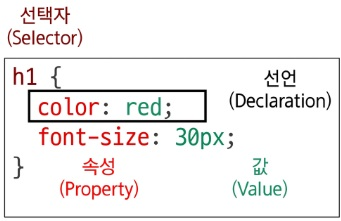

---
#### CSS Selectors(선택자)
HTML 요소를 선택하여 스타일을 적용할 수 있도록 하는 선택자  
```bash
- 전체 선택자(*): HTML 모든 요소를 선택
- 요소 선택자: 지정한 모든 태그를 선택
- 클래스 선택자('.'): 주어진 클래스 속성을 가진 모든 요소 선택
- 아이디 선택자('#'): 주어진 아이디 속성을 가진 요소 선택, 아이디는 문서에 하나만 있어야함
- 속성 선택자('[]'): 주어진 속성이나 속성값을 가진 모든 요소 선택, 다양한 조건으로 요소를 정교하게 선택 가능
```
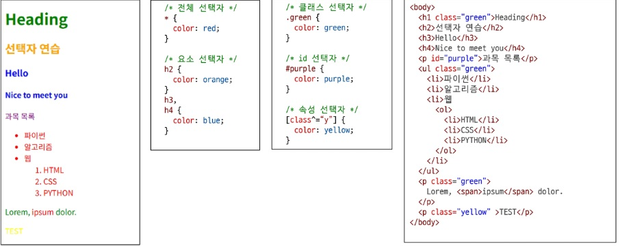

---
#### CSS 결합자(Combinators)
```bash
- 자손 결합자( ): 첫 번째 요소의 자손 요소들 선택 ex) p span = <p> 안에 있는 모든 <span> 선택
- 자식 결합자(>): 첫 번째 요소의 직계 자식만 선택 ex) ul > li = <ul> 안에 있는 한 단계 아래의 모든 <li>를 선택
```
---
#### CSS Declaration(선언)
선택된 요소에 적용할 스타일을 구체적으로 명시하는 부분  
```bash
CSS 선언의 목적
- 선택자는 '어떤 요소'에 스타일을 적용할지 결정하는 규칙, 선택자로 선택을 했으니
- 중괄호 {} 안에 '무엇을' 할 지 정의하는 부분이 선언
```
구조: { 속성: 값; }  
속성(Property): 스타일링하고 싶은 기능이나 특성(미리 정의해 둔 키워드를 사용)  
값(Value): 속성에 적용될 구체적인 설정(값의 종류도 정해져 있음), 0일 때는 생략  
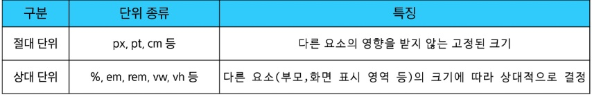
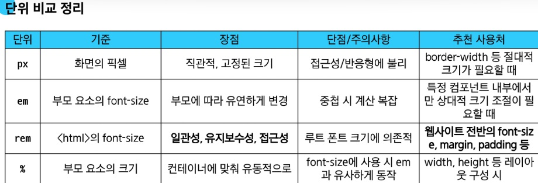

---
#### 명시도
요소에 적용할 CSS 선언을 결정하기 위한 알고리즘  
**Cascading** Style Sheet: 한 요소에 동인한 가중치의 선택자가 적용되면 계단식으로 마지막 선언 사용
```bash
명시도 높은 순서
!important > Inline 스타일 > 선택자(id > class > 요소) > 소스 코드 선언 순서
important는 다른 구조를 무시하고 강제 적용이므로 지양한다
```
---
#### 상속
기본적으로 CSS는 부모 요소의 속성을 자식에게 상속해 재사용성을 높임  
- 상속 O: text 관련 요소(font, color, text-align), opacity, visibility 등
- 상속 X: Box model 관련 요소(iwdth, height, border ..), position 관련 요소(position, top/right/bottom/left) 등  
MDN에서 상속 확인 가능
---
#### CSS Box Model
웹 페이지의 모든 HTML 요소를 감싸는 사각형 상자 / 요소의 크기, 배치, 간격을 결정하는 규칙  
```bash
외부 간격(margin) > 테두리(border) > 안쪽 여백(padding) > 내용(content)
```
shorthand 속성(단축 속성): 빨리 하려고 둔 설정
```bash
border: width style color / 순서는 영향 x
margin, padding : 상 우 하 좌 / 상 좌우 하 / 상하 좌우 / 공통
```
표준 상자 모델에선 width height 속성 값을 설정하면 내용(content) 박스의 크기가 조정됨  
*{box-sizing: border-box;} = 원하는 대로 상자 크기가 조절됨

---
##### 박스 표시(Display) 타입
박스 타입에 따라 페이지에서의 배치 흐름, 다른 박스와 관련해 동작 방식이 달라짐
1. Outer display 타입
    - block 타입
    - inline 타입
2. Inner display 타입
    - 박스 내부의 요소들이 어떻게 배치될지를 결정
    - CSS Flexbox(속성: flex)

---
1. Block 타입: 하나의 독립된 덩어리처럼 동작하는 요소  
각 책의 문단처럼 다른 문단이 옆에 끼어들 수 없어서 웹 페이지의 큰 구조와 단락을 만드는데 사용
    - 항상 새로운 행으로 나뉨 (한 줄 전체를 차지, 너비 100%)
    - width, height, margin, padding 속성 모두 사용 가능
    - padding, margin, border로 다른 요소를 상자로부터 밀어냄
    - width 속성을 지정하지 않으면 박스는 inline 방향으로 사용 가능한 공간을 모두 차지함
    - 대표적인 block 타입: h1~6, p, div, ul, li  
    div: 다른 HTML 요소들을 그룹화하여 레이아웃을 구성하거나 스타일링을 적용  
    헤더, 푸터, 사이드바 등 웹 페이지의 **다양한 섹션을 구조화하는데** 가장 많이 쓰임
---
2. Inline 타입: 문장 안의 단어처럼 흐름에 따라 자연스럽게 배치되는 요소  
단어에 칠한 형광펜처럼 줄을 바꾸지 않고, 텍스트의 일부에 다른 스타일을 적용할 때 사용
    - 줄바꿈이 일어나지 않음(콘텐츠의 크기만큼만 영역을 차지)
    - width와 height 속성을 사용할 수 없음
    - 수직 방향(상하): padding, margin, border 각 적용되지만, 다른 요소를 밀 수는 없음
    - 수평 방향(좌우): padding, margin, border로 다른 요소를 밀 수 있음
    - 대표적인 Inline 타입: a, img, span, strong  
    span: 자체적으로 시각적 변화 없음(스타일을 적용하기 전까지는 특별한 변화 X)  
    텍스트 일부 조작(문장 내 특정 단어나 구문에만 스타일을 적용할 때 유용)  
    블록 요소처럼 줄바꿈을 일으키지 않아서, 구조에 큰 변화를 주지 않음
---
3. CSS Flexbox  
요소를 행과 열 형태로 배치하는 1차원 레이아웃 방식: 공간 배열 & 정렬  
책장(Flex 컨테이너) 안에 책들(Flex 아이템)을 넣고, "책들을 왼쪽에 붙여줘" 같은 명령을 통해 손쉽게 배치할 수 있다
    - Flexbox 구성 요소:
        - main axis(주 축): item들이 배치되는 기본 축, main start ~ end 방향으로 배치(기 값)
        - cross axis(교차 축) main에 수직인 축, cross start ~ end 방향으로 배치(기본값)
        - flex container: 배치할 아이템의 속성이 설정된 부모 요소, 컨테이너의 1차 자식 요소들이 아이템이 됨
        - flex item: 배치할 아이템들, item 속성으로 순서 변경/정렬 가능
        ---
    - Flexbox Container 관련 속성
        1. display:
        - display 속성을 flex로 설정하면 Flexbox Container로 지정됨  
        - 기본적으로 행(주 축의 기본 값)으로 나열, 주 축의 시작선에서 시작
        - flex item은 교차 축의 크기를 채우기 위해 늘어남
        2. flex-direction:
        - flex item이 나열되는 방향을 지정
        - row 기본값  
        column 세로 방향 위에서 아래로 배치  
        -reverse 반대로  
        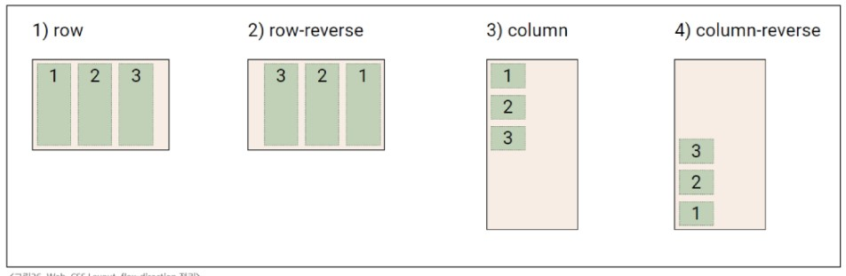
        3. flex-wrap:
        - flex item 목록이 flex container의 한 행에 들어가지 않으면, 다른 행에 배치할지 여부 설정
        - nowrap 기본값  
        wrap 여러 줄에 배치될 수 있게 설정  
        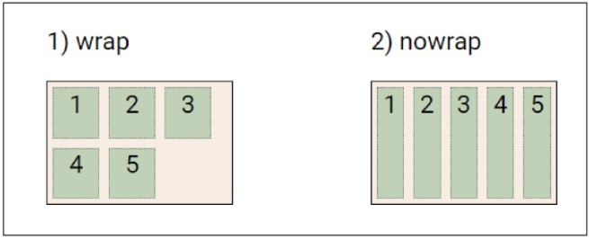
        4. justify-content:
        - 주 축을 따라 flex item들을 정렬하고 간격을 조정
        - flex-start(기본값) 주 축의 시작점으로 정렬  
        center 주 축의 중앙으로 정렬  
        flex-end 주 축의 끝점으로 정렬  
        space-between 첫 아이템은 시작점, 마지막 아이템은 끝점 나머지 아이템 사이의 간격을 균등배분  
        space-around 각 아이템의 둘레에 균등한 간격으로 배분(양 끝 아이템은 절반의 간격이 설정)  
        space-evenly 모든 아이템들 사이와 양 끝 간격 균등배분  
        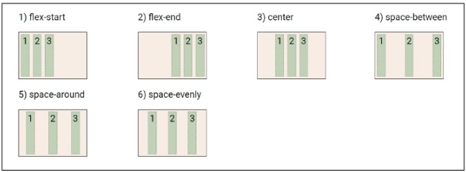
        5. align-content:
        - 컨테이너에 여러 줄의 flex item이 있을 때, 그 줄들 사이의 공간을 어떻게 분배할지 지정
        - flex-wrap이 기본값이 아니게 설정된 행에만 적용
        - stretch(기본값) 교차 축에 맞게 늘려 빈 공간을 채움  
        center 교차 축의 중앙에 맞춰 정렬  
        flex-start 교차 축의 시작점(보통 위쪽)에 맞춰 정렬  
        flex-end 교차 축의 끝점(보통 아래쪽)에 맞춰 정렬  
        space-between 첫 줄은 시작점, 마지막 줄은 끝점 나머지 줄들 사이의 간격을 균등배분  
        space-around 각 줄의 위아래에 균등한 간격으로 배분(컨테이너의 시작과 끝에는 절반의 간격이 설정)  
        space-evenly 모든 줄들 사이와 양 끝 간격 균등배분  
        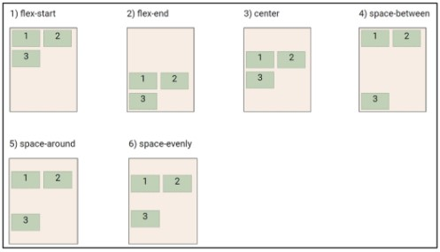
        6. align-items:
        - 컨테이너 안에 있는 flex item 들의 교차 축 정렬 방법을 지정
        - stretch(기본값) 교차 축 높이를 꽉 채우도록 늘어남  
        center 교차 축 중앙에 맞춰 정렬  
        flex-start 교차 축의 시작점(가로 방향일 경우 위쪽)에 맞춰 정렬  
        flex-end 교차 축의 끝점(가로 방향일 경우 아래쪽)에 맞춰 정렬  
        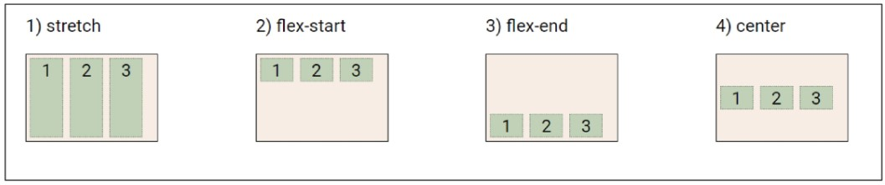
        ---
    - Flex item 관련 속성
        1. align-self:
            - 컨테이너 안에 있는 flex item 들을 교차 축을 따라 개별적으로 정렬
            - auto(기본값) 부모 컨테이너의 align-items 속성 값을 상속  
            stretch 교차축 방향으로 늘어나 컨테이너를 꽉 채우게 정렬  
            center 교차 축의 중앙에 정렬  
            flex-start 교차 축의 시작점(가로 방향일 경우 위쪽)에 맞춰 정렬  
            flex-end 교차 축의 끝점(가로 방향일 경우 아래쪽)에 맞춰 정렬  
            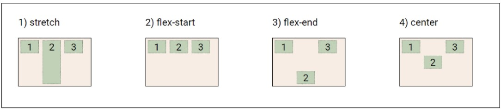
        2. flex-grow:
            - 남는 행 여백을 비율에 따라 각 item에 분배
            - flex item이 컨테이너 내에서 확장하는 비율을 지정
            - 총합 분의 x 값만큼 분배 ex)1, 2, 3 이면 첫 item에 6분의 1만큼
        3. flex-basis:
            - item의 초기 크기 값을 지정
            - flex-basis와 width 값을 동시에 적용하면 flex-basis가 우선
        ---
    - 목적에 따른 속성 분류
        - 배치: flex-direction, flex-wrap
        - 공간 분배: justify-content, align-content
        - 정렬: align-items, align-self
    - TIP!: justify=주축 align=교차축 content=여러줄 items=1줄 self=1개

---
4. 기타 display 속성
    1. inline-block: 두가지 특징을 모두 가진 특별한 display 속성  
'줄 서 있는 사람들' 처럼 한 줄로 서있지만(inline) 각자 공간을 가지고 있다(block)
        - 줄바꿈 없이 크기 지정 가능
        - width, height 속성 사용 가능
        - padding, margin, border로 다른 요소를 밀 수 있음
    2. none: 요소를 화면에 표시하지 않고, 공간조차 부여되지 않음(후보 선수)
---

#### Normal flow
일반적인 흐름, 레이아웃을 변경하지 않은 경우 웹 페이지 요소가 배치되는 방식  
워드 문서를 예로 들면, 엔터를 눌러 문단을 나누는 것이 block, 계속 타이핑을 하는 것이 inline 배치 방식

---
### CSS Position
Css Layout:
- 각 요소의 위치와 크기를 조정해 웹 페이지의 디자인을 결정
-  요소들을 상하좌우로 정렬하고, 간격을 맞추고, 전체적인 뼈대를 구성
- 핵심 속성: display(block, inline, flex, grid ...)  
---
Css position:
- 요소를 Noraml Flow에서 제거해 다른 위치로 배치
- 다른 요소 위에 올리기, 화면 특정 위치에 고정시키기 등
- 핵심 속성: position(static, relative, absolute, fixed, sticky ...)
- 이동 방향: 상, 하, 좌, 우를 이용해 위치를 조절할 수 있고, Z축을 이용해 쌓이는 순서도 조절할 수 있음
---
#### Position 유형
1. static:
    - Normal flow에 따라 배치
    - 기본 값(top, right, bottom, left 적용X)
2. relative:
    - Normal flow에 따라 배치
    - (top, right, bottom, left)로 자신의 원래 위치를 기준으로 이동
    - 다른 요소의 레이아웃에 영향을 주지 않음(요소가 차지하는 공간은 static과 같음)
3. absolute:
    - Normal flow에서 제거
    - (top, right, bottom, left)로 가장 가까운 relative 부모 요소를 기준으로 이동(없다면 body 태그가 기준)
    - 문서에서 요소가 차지하는 공간이 없어짐
4. fixed:
    - Normal flow에서 제거
    - (top, right, bottom, left)로 현재 화면영역(viewport)을 기준으로 이동
    - 스크롤해도 항상 같은 위치에 유지됨
    - 문서에서 요소가 차지하는 공간이 없어짐
5. sticky:
    - relative와 fixed를 결합한 속성
    - relative처럼 동작하다가 스크롤 위치가 임계점에 도달하면 fixed처럼 화면에 고정
    - 다음 sticky가 나오면 이전 sticky 자리를 대체
6. z-index:
    - 요소의 쌓임 순서를 정의하는 속성
    - 정수 값이 클 수록 위에 쌓임
    - static이 아닌 요소에만 적용
    - 기본값은 auto로 부모 요소의 값에 영향을 받음
    - 같은 부모 내에서만 값을 비교하고, 값이 같으면 HTML 문서 순서대로 쌓임
    - 부모의 값이 낮으면 자식의 값이 아무리 높아도 부모보다 올라갈 수 없음
---
##### 참고
Margin collapsing(마진 상쇄): 두 block 타입의 top과 바텀이 만나면 더 큰 margin으로 결합  
박스 타입별 수평 정렬: 02-boxmodel > 99-horizontal-align 코드 참고

---
### Bootstrap
CSS 프론트엔드 프레임워크 (Toolkit): 미리 만들어진 다양한 디자인 요소들을 제공하여 웹 사이트를 빠르고 쉽게 개발할 수 있도록 함

---
#### CDN
    - 서버와 사용자 사이의 물리적인 거리를 줄여 콘텐츠 로딩에 소요되는 시간을 최소화: 웹페이지 로드 속도를 높임
    - 지리적으로 사용자와 가까운 CDN 서버에 콘텐츠를 저장해서 사용자에게 전달
---
#### Bootstrap 기본 사용법
- Bootstrap에는 특정한 규칙이 있는 클래스 이름으로 스타일 및 레이아웃이 미리 작성되어 있음  
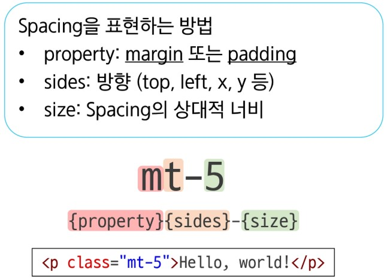
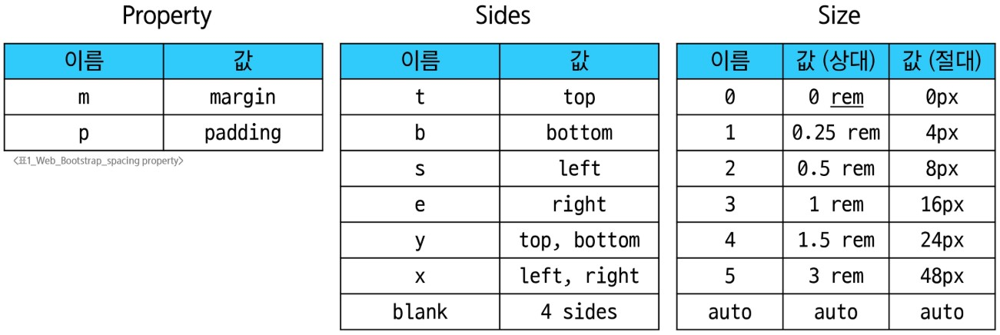
---
#### Reser CSS
모든 HTML 요소 스타일을 일관된 기준으로 재설정하는 간결하고 압축된 규칙 시트
- Reset CSS 사용 배경:  
    - 모든 브라우저는 각자의 'user agent stylesheet'를 가지고 있음
    - 브라우저마다 설정이 달라서 동일하게 보이게 만들기 힘들어서 사용 시작
- User-agent stylesheets: 모든 문서에 기본 스타일을 제공하는 시트
Normalize CSS:
- Reset CSS의 대표적인 방법(Bootstrap이 사용)
- 웹 표준 기준으로 브라우저 중 하나가 불일치하면 차이가 있는 브라우저를 수정하는 방법
---
#### Typography
제목, 본문 텍스트, 목록 등
- Display headings: 기존 Heading보다 더 눈에 띄는 제목이 필요한 경우(class="display-1")
- Inline text elements: HTML inline 요소에 대한 스타일
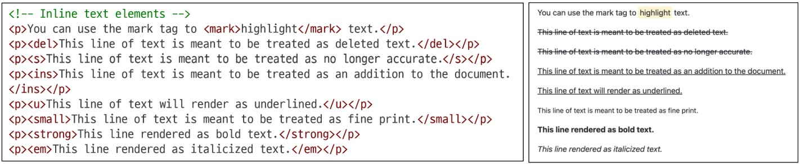
- Lists: HTML list 요소에 대한 스타일
---
#### Colors
- Bootstrap이 지정하고 제공하는 색상 시스템
- 의미론적 관점의 색상을 적용할 수 있게 해줌(red 대신 danger 등)
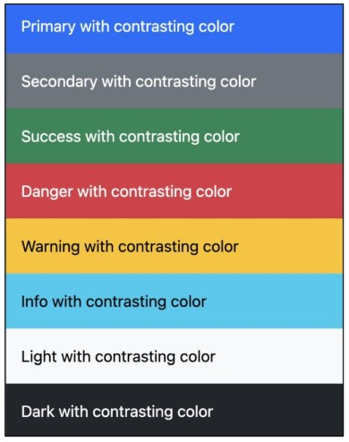
---
#### Component
UI 관련 요소(버튼, 네비게이션 바, 카드, 폼, 드롭다운 등)
- 이점: 일관된 디자인을 제공해 웹 사이트 구성 요소를 구축하는데 유용함
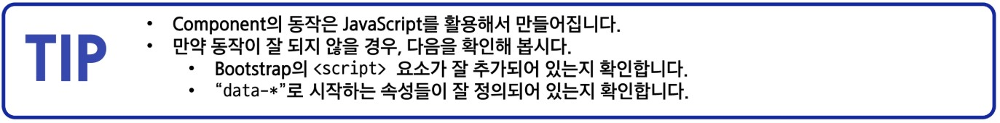
---
### Semantic Web
웹 데이터를 의미론적으로 구조화된 형태로 표현하는 방식(시각적 측면이 아닌 목적과 역할에 집중하는 방식) ex)h1은 최상위 제목이다

---
#### HTML Semantic Element
기본적인 모양과 기능 이외의 의미를 가지는 HTML 요소  
검색엔진 및 개발자가 웹 페이지의 콘텐츠를 이해하기 쉽게 해준다
- header: 소개 및 탐색에 도움을 주는 콘텐츠
- nav: 현재 페이지 내, 또는 다른 페이지로의 링크를 보여주는 구획
- main: 문서의 주요 콘텐츠
- article: 독립적으로 구분해 배포하거나 재사용될 수 있는 구성의 콘텐츠 구획
- section: 문서의 독립적인 구획, 더 작합한 요소가 없을 때 사용
- aside: 문서의 주요 내용과 간접적으로만 연관된 부분
- footer: 가장 가까운 조상 구획(main, article 등)의 작성자, 저작권 정보, 관련 문서
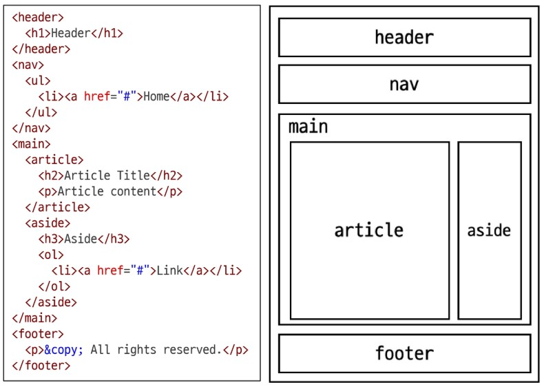
---
#### Semantic in CSS
CSS 방법론: CSS를 효율적이고 유지 보수가 용이하게 작성하기 위한 일련의 가이드라인  
OOCSS(Object Oriented CSS): 객체 지향적 접근법을 적용해 CSS를 구성하는 방법론
1. 구조와 스킨을 분리: 재사용 가능성을 높임
    - .blue-button, .red-button > .button, .button-blue, .button-red
    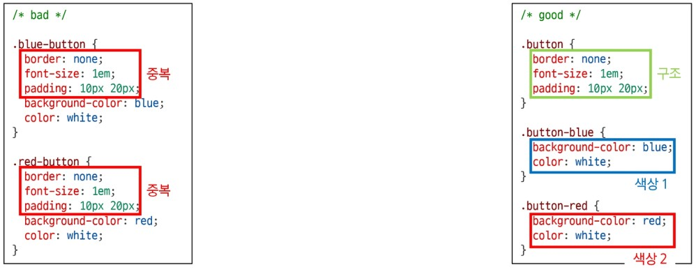
2. 컨테이너와 콘텐츠를 분리
    - 객체에 직접 적용하는 대신 객체를 둘러싼 컨테이너에 스타일 적용
    - 스타일을 정의할 때 위치에 의존적인 스타일 사용하지 않도록 함
    - 콘텐츠를 다른 컨테이너로 이동시키거나 재배치할 때 스타일이 깨지는 것을 방지
    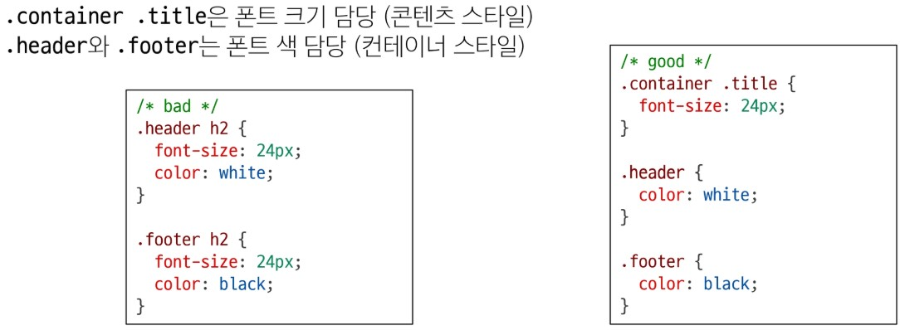