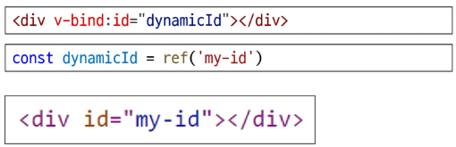

# Template Syntax
HTML에 Vue만의 특별한 문법을 추가해서 사용하는 것
- Text Interpolation
  - 데이터 바인딩의 가장 기본적인 형태
  - 이중 중괄호 구문 (콧수염 구문)을 사용
  - 콧수염 구문은 해당 컴포넌트 인스턴스의 msg 속성 값으로 대체
  - msg 속성이 변경될 때마다 업데이트 됨 `
Message: {{msg}}
`
- Raw HTML(권장x)
  - 콧수염 구문은 데이터를 일반 텍스트로 해석하기 때문에 실제 HTML을 출력하려면 v-html을 사용해야함
  - `
 v-html="rawHtml">
`
  - `const rawHtml = ref('span style="color:red">This should be red.')`
- Attribute Bindings(필수)
  - 콧수염 구문은 HTML 속성 내에서 사용할 수 없기 때문에 v-bind를 사용
  - HTML의 id 속성 값을 vue의 dynamicld 속성과 동기화 되도록 함
  - 바인딩 값이 null이나 undefind인 경우, 해당 속성은 렌더링 요소에서 제거됨
  
- JavaScript Expressions